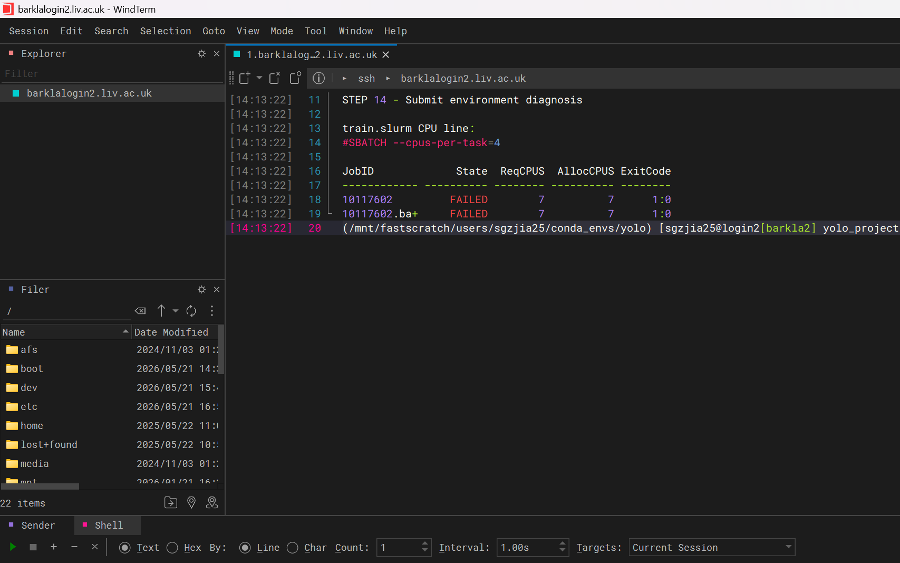
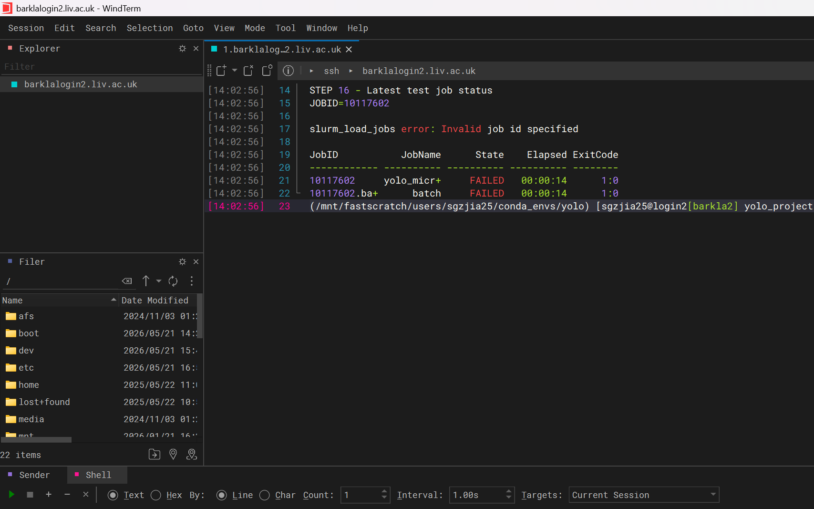
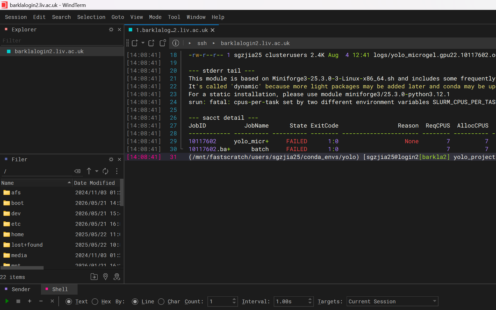
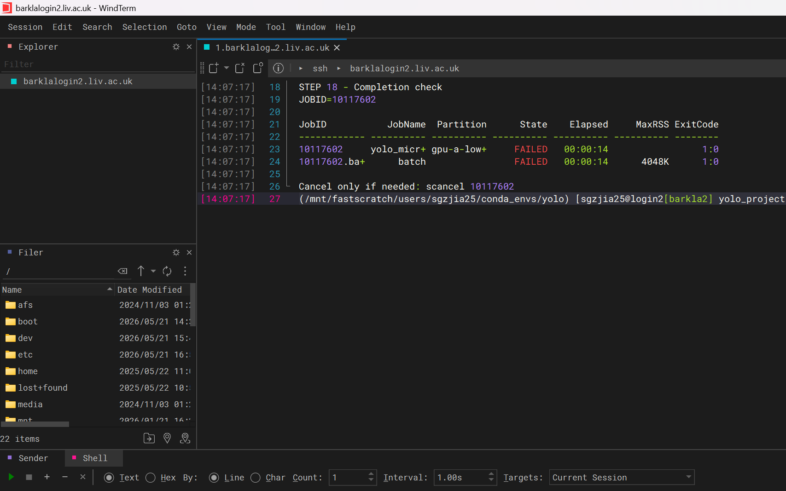
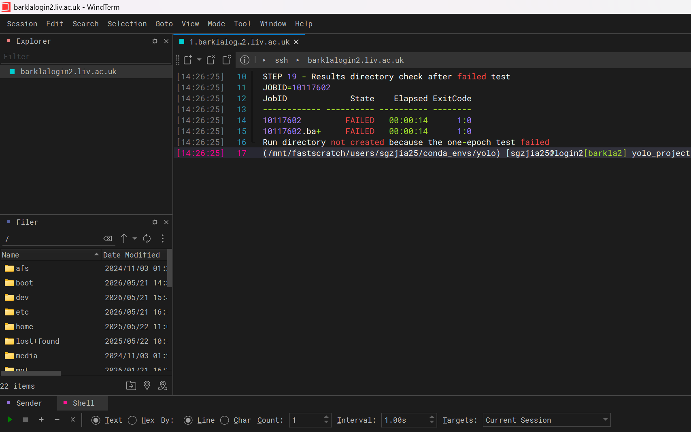

# Complete Guide: Windows to Barkla HPC to YOLO Training

Last audited: 4 August 2026

This README is a step-by-step Windows -> Barkla HPC -> YOLO training guide for the microgel dataset. The screenshots in `screenshots_steps/` were rechecked before upload; old cropped or mismatched screenshots were removed from the GitHub version.

## Current Audited State

Use this section before following the later training steps.

- Barkla username used in the screenshots: `sgzjia25`
- Project directory: `/mnt/fastscratch/users/sgzjia25/yolo_project`
- `train.py` is present on Barkla and passes `python -m py_compile train.py`.
- Dataset check passed: 63 train images, 63 train labels, 18 validation images, 18 validation labels.
- `weights/yolo26m.pt` exists.
- Test jobs `10117422` and `10117602` failed. The latest checked job, `10117602`, failed after 14 seconds with a Slurm CPU environment conflict.
- No production training job has completed, and no result directory was created for job `10117602`.

Do not submit production training until a new one-epoch Slurm test job is `COMPLETED` and the logs/results are clean. Do not run YOLO training directly on a login node.

## Step 1: Install or Open WinSCP and WindTerm

Install these tools on Windows:

- WinSCP: <https://winscp.net/eng/download.php>
- WindTerm: <https://github.com/kingToolbox/WindTerm/releases>

WinSCP is used for file upload/download. WindTerm is used for SSH commands on Barkla.


## Step 2: Connect to Barkla with WindTerm

Create an SSH session in WindTerm:

```text
Host: barklalogin2.liv.ac.uk
Port: 22
Username: your University username
```

Enter your University password and complete any required MFA. If you are off campus and the connection fails, connect to the University VPN first.

After login, run only lightweight checks:

```bash
whoami
hostname
pwd
```


Login nodes are for file management, environment setup, short checks and Slurm submission. Training must run through Slurm.

## Step 3: Create the Project Directory

Create the project folders on `fastscratch`:

```bash
export PROJECT="/mnt/fastscratch/users/$USER/yolo_project"
export YOLO_ENV="/mnt/fastscratch/users/$USER/conda_envs/yolo"

mkdir -p "$PROJECT/dataset"
mkdir -p "$PROJECT/logs"
mkdir -p "$PROJECT/weights"

cd "$PROJECT"
pwd
ls -lh
```

For this account, the project path is:

```text
/mnt/fastscratch/users/sgzjia25/yolo_project
```


`fastscratch` is suitable for datasets, checkpoints and outputs, but it should not be the only long-term copy of important results.

## Step 4: Connect with WinSCP and Upload the Dataset

Open WinSCP and connect with SFTP:

```text
File protocol: SFTP
Host name:     barklalogin2.liv.ac.uk
Port number:   22
User name:     your University username
Password:      your University password
```

On the remote side, open:

```text
/mnt/fastscratch/users/sgzjia25/yolo_project
```

Upload the dataset into:

```text
/mnt/fastscratch/users/sgzjia25/yolo_project/dataset
```

Required YOLO structure:

```text
yolo_project/
  dataset/
    images/
      train/
      val/
    labels/
      train/
      val/
    data.yaml
```

The WinSCP screenshot is only for the file-transfer interface. Script existence is verified later in WindTerm.


## Step 5: Create and Check `data.yaml`

Create `dataset/data.yaml`:

```bash
export PROJECT="/mnt/fastscratch/users/$USER/yolo_project"

cat > "$PROJECT/dataset/data.yaml" <<YAML
path: $PROJECT/dataset
train: images/train
val: images/val

names:
  0: microgel
YAML
```

Check it:

```bash
cat "$PROJECT/dataset/data.yaml"
test -f "$PROJECT/dataset/data.yaml" && echo "data.yaml OK"
```

The filename must be exactly `data.yaml`, not `data.yalm`.


## Step 6: Load the Miniforge Conda Module

Check the live module name first:

```bash
module --ignore-cache spider 2>&1 | grep -iE "anaconda|miniconda|miniforge|conda|python"
module spider miniforge3
```

The checked module was:

```text
miniforge3/25.3.0-python3.12.10-dynamic
```

Load it and verify Conda:

```bash
module load miniforge3/25.3.0-python3.12.10-dynamic
which conda
conda --version
```


If Barkla changes the module name, use the current name returned by `module spider`.

## Step 7: Create or Activate the YOLO Conda Environment

Create the environment once:

```bash
module load miniforge3/25.3.0-python3.12.10-dynamic
eval "$(conda shell.bash hook)"

mkdir -p "/mnt/fastscratch/users/$USER/conda_envs"

conda create \
    -p "/mnt/fastscratch/users/$USER/conda_envs/yolo" \
    python=3.11 \
    pip \
    -y
```

In later sessions, activate it:

```bash
module load miniforge3/25.3.0-python3.12.10-dynamic
eval "$(conda shell.bash hook)"
conda activate "/mnt/fastscratch/users/$USER/conda_envs/yolo"

which python
python --version
python -m pip --version
```

Do not continue if `which python` points to `/usr/bin/python`.


## Step 8: Install and Verify PyTorch and Ultralytics

Activate the environment:

```bash
export PROJECT="/mnt/fastscratch/users/$USER/yolo_project"
export YOLO_ENV="/mnt/fastscratch/users/$USER/conda_envs/yolo"

module load miniforge3/25.3.0-python3.12.10-dynamic
eval "$(conda shell.bash hook)"
conda activate "$YOLO_ENV"
```

Install:

```bash
python -m pip install \
    torch==2.8.0 \
    torchvision==0.23.0 \
    --index-url https://download.pytorch.org/whl/cu128

python -m pip install ultralytics==8.4.102
```

Verify:

```bash
python -m pip check
python -c "import torch; print('PyTorch:', torch.__version__); print('Built CUDA:', torch.version.cuda)"
python -c "import ultralytics; print('Ultralytics:', ultralytics.__version__)"
python -c "from ultralytics import YOLO; print('YOLO import successful')"
```

Record the environment:

```bash
cd "$PROJECT"
python -m pip freeze > yolo_requirements.txt
grep -iE "torch|torchvision|ultralytics" yolo_requirements.txt
```


## Step 9: Check Dataset Counts and Model Weights

Run:

```bash
export PROJECT="/mnt/fastscratch/users/$USER/yolo_project"
cd "$PROJECT"

test -f dataset/data.yaml && echo "data.yaml OK"
test -d dataset/images/train && echo "training images OK"
test -d dataset/images/val && echo "validation images OK"
test -d dataset/labels/train && echo "training labels OK"
test -d dataset/labels/val && echo "validation labels OK"

echo -n "train images: "
find dataset/images/train -type f \( -iname '*.jpg' -o -iname '*.jpeg' -o -iname '*.png' -o -iname '*.tif' -o -iname '*.tiff' \) | wc -l

echo -n "train labels: "
find dataset/labels/train -type f -name '*.txt' | wc -l

echo -n "val images: "
find dataset/images/val -type f \( -iname '*.jpg' -o -iname '*.jpeg' -o -iname '*.png' -o -iname '*.tif' -o -iname '*.tiff' \) | wc -l

echo -n "val labels: "
find dataset/labels/val -type f -name '*.txt' | wc -l
```

Checked counts:

```text
train images: 63
train labels: 63
val images:   18
val labels:   18
```

Download or verify the pretrained model before requesting a GPU:

```bash
cd "$PROJECT/weights"
python -c "from ultralytics import YOLO; YOLO('yolo26m.pt'); print('YOLO26m is ready')"
ls -lh yolo26m.pt
```


## Step 10: Create and Check `train.py`

Use the `train.py` file included in this repository, or create the same file in:

```text
/mnt/fastscratch/users/sgzjia25/yolo_project/train.py
```

Important paths inside the script:

```python
PROJECT_ROOT = Path(__file__).resolve().parent
DATA_YAML = PROJECT_ROOT / "dataset" / "data.yaml"
MODEL_WEIGHTS = PROJECT_ROOT / "weights" / "yolo26m.pt"
RUNS_DIR = PROJECT_ROOT / "runs"
```

Check:

```bash
cd "/mnt/fastscratch/users/$USER/yolo_project"
ls -lh train.py example.py train.slurm yolo_requirements.txt
python -m py_compile train.py && echo "train.py syntax OK"
```

Earlier, `train.py` was missing on Barkla. It was restored from the existing `example.py`, and the syntax check now passes.


## Step 11: Check GPU Partition and Module Names

Check the live GPU partitions:

```bash
sinfo -o "%20P %15a %20G %15l" | grep -i gpu
sinfo -p gpu-a-lowsmall
scontrol show partition gpu-a-lowsmall
```

Check the module:

```bash
module spider miniforge3/25.3.0-python3.12.10-dynamic
```


If a partition or module no longer exists, stop and use the exact current Barkla name.

## Step 12: Create or Update `train.slurm`

Use the `train.slurm` file included in this repository as the template. It requests:

```text
partition: gpu-a-lowsmall
GPU:       1
CPUs:      4
memory:    32G
time:      24:00:00
```

Important: this README template launches the Python program directly inside the Slurm batch allocation:

```bash
python -u train.py --epochs "$EPOCHS" --imgsz "$IMGSZ" --batch "$BATCH" --workers "$WORKERS"
```

It does not use a nested `srun python ...` line for the Python training command. The previous nested `srun` form was associated with the Slurm CPU environment conflict seen in job `10117602`.

If your remote `train.slurm` still contains `srun python`, back it up and replace only that launcher:

```bash
cd "/mnt/fastscratch/users/$USER/yolo_project"
cp -p train.slurm train.slurm.backup_20260804
perl -0pi -e 's/\bsrun python -u train\.py\b/python -u train.py/g' train.slurm
bash -n train.slurm
grep -nE 'python -u train.py|srun python|cpus-per-task' train.slurm
```


## Step 13: Run Final Pre-submission Checks

These checks do not train the model:

```bash
export PROJECT="/mnt/fastscratch/users/$USER/yolo_project"

python -m py_compile "$PROJECT/train.py" && echo "train.py OK"
bash -n "$PROJECT/train.slurm" && echo "train.slurm OK"
test -f "$PROJECT/dataset/data.yaml" && echo "data.yaml OK"
test -s "$PROJECT/weights/yolo26m.pt" && echo "model OK"
test -d "$PROJECT/dataset/images/train" && echo "training images OK"
test -d "$PROJECT/dataset/images/val" && echo "validation images OK"
test -d "$PROJECT/dataset/labels/train" && echo "training labels OK"
test -d "$PROJECT/dataset/labels/val" && echo "validation labels OK"
```

Only continue if every line is OK.


## Step 14: Submit a One-epoch Test Job Only

Submit only a small test first:

```text
epochs = 1
imgsz  = 640
batch  = 2
```

Use a fresh WindTerm SSH session if possible. Before submission, check for stale Slurm submit variables:

```bash
env | grep -E '^(SLURM|SBATCH)_' || echo "No SLURM/SBATCH variables in the submit shell"
```

Then submit the test job:

```bash
export PROJECT="/mnt/fastscratch/users/$USER/yolo_project"
cd "$PROJECT"

unset SLURM_CPUS_PER_TASK SLURM_TRES_PER_TASK SBATCH_CPUS_PER_TASK SBATCH_TRES_PER_TASK

JOBID=$(sbatch --parsable \
    --export=YOLO_EPOCHS=1,YOLO_IMGSZ=640,YOLO_BATCH=2 \
    train.slurm)

JOBID="${JOBID%%;*}"
printf '%s\n' "$JOBID" > .last_job_id
echo "Submitted test job: $JOBID"
```

Immediately check it:

```bash
squeue -j "$JOBID" -o "%.12i %.14P %.16j %.10T %.8M %.12R"
sacct -j "$JOBID" --format=JobID,State,ReqCPUS,AllocCPUS,ExitCode
```

The latest audited test job failed, so do not proceed to production yet:



If another one-epoch test fails immediately with a Slurm CPU environment conflict, stop and ask Barkla support or your supervisor. Repeated failed submissions are not a useful use of the cluster.

## Step 15: Production Training Is Locked Until the Test Passes

Do not submit production training while the one-epoch test is failed or pending.

Only after the main test job row is `COMPLETED`, logs contain no traceback or out-of-memory error, and expected result files exist, submit production:

```bash
export PROJECT="/mnt/fastscratch/users/$USER/yolo_project"
cd "$PROJECT"

JOBID=$(sbatch --parsable \
    --export=YOLO_EPOCHS=100,YOLO_IMGSZ=1280,YOLO_BATCH=-1 \
    train.slurm)

JOBID="${JOBID%%;*}"
printf '%s\n' "$JOBID" > .last_job_id
echo "Submitted production job: $JOBID"
```

This production command is intentionally not run in the current audited state.

## Step 16: Check Job Status

Restore the latest job ID:

```bash
export PROJECT="/mnt/fastscratch/users/$USER/yolo_project"
cd "$PROJECT"

JOBID=$(cat .last_job_id)
echo "JOBID=$JOBID"
```

Check Slurm:

```bash
squeue -j "$JOBID" -o "%.12i %.14P %.16j %.10T %.8M %.12R"
sacct -j "$JOBID" --format=JobID,JobName,State,Elapsed,ExitCode
```

The latest checked job is failed, not pending:



## Step 17: Inspect Logs and Diagnose Failures

List logs:

```bash
export PROJECT="/mnt/fastscratch/users/$USER/yolo_project"
cd "$PROJECT"

JOBID=$(cat .last_job_id)
ls -lh logs/*"$JOBID"*
```

View output:

```bash
tail -n 80 logs/yolo_microgel.*."$JOBID".out
```

View errors:

```bash
tail -n 80 logs/yolo_microgel.*."$JOBID".err
```

For job `10117602`, the error was a Slurm CPU environment conflict. This is why production remains blocked.



## Step 18: Check Completion, Resume or Cancel

Check final accounting:

```bash
JOBID=$(cat .last_job_id)
sacct -j "$JOBID" --format=JobID,JobName,Partition,State,Elapsed,MaxRSS,ExitCode
```

Only proceed if the main job row says `COMPLETED`.

Current audited state:



Resume an interrupted completed allocation only when a `last.pt` checkpoint exists:

```bash
export PROJECT="/mnt/fastscratch/users/$USER/yolo_project"
cd "$PROJECT"

OLD_JOBID=123456
LAST_PT="$PROJECT/runs/microgel_yolo26m_${OLD_JOBID}/weights/last.pt"
test -s "$LAST_PT" && echo "Checkpoint found: $LAST_PT"

JOBID=$(sbatch --parsable \
    --export=YOLO_RESUME="$LAST_PT" \
    train.slurm)

JOBID="${JOBID%%;*}"
printf '%s\n' "$JOBID" > .last_job_id
echo "Submitted resume job: $JOBID"
```

Cancel only a specific job when needed:

```bash
scancel "$JOBID"
squeue -j "$JOBID"
```

Do not use `scancel -u "$USER"` unless you really intend to cancel every queued and running job owned by the account.

## Step 19: Locate Results

After a successful job:

```bash
export PROJECT="/mnt/fastscratch/users/$USER/yolo_project"
cd "$PROJECT"

JOBID=$(cat .last_job_id)
RUN_DIR="$PROJECT/runs/microgel_yolo26m_${JOBID}"

find "$RUN_DIR" -maxdepth 2 -type f | sort
ls -lh "$RUN_DIR/weights"
```

Expected files after a successful run:

```text
weights/best.pt
weights/last.pt
results.csv
results.png
args.yaml
```

Current audited state: job `10117602` failed, so no result directory was created.



## Step 20: Download Results with WinSCP

Only after a successful job creates a run directory, use WinSCP to download:

```text
weights/best.pt
weights/last.pt
results.csv
results.png
confusion_matrix.png
PR_curve.png
F1_curve.png
args.yaml
```

Also keep the matching setup files:

```text
train.py
train.slurm
dataset/data.yaml
yolo_requirements.txt
```

Download results promptly or move them to University-approved long-term storage. `fastscratch` should not be the only copy.

## Quick Safety Checklist

- Do not run YOLO training on login nodes.
- Use Slurm for GPU compute.
- Start with a one-epoch test.
- Do not submit production until the test job is `COMPLETED`.
- If a Slurm or policy error repeats, stop and ask Barkla support or your supervisor.
- Keep screenshots and README text synchronized with the real job state.
