# Complete Guide: Windows → Barkla HPC → YOLO Training

Last checked: 4 August 2026

This guide covers the complete workflow:

1. Install WinSCP and WindTerm on Windows.
2. Connect to the University of Liverpool Barkla HPC.
3. Create a project directory on `fastscratch`.
4. Upload a YOLO object-detection dataset.
5. Create a Conda environment.
6. Install PyTorch and Ultralytics.
7. Download the pretrained YOLO26m weights before requesting a GPU.
8. Create the Python training program and Slurm job script.
9. Run a short test job, then submit production training.
10. Monitor the job, inspect GPU usage and logs, resume interrupted training, and download the results.

The examples assume the following University username and project directory:

```text
Username: sgzjia25
Project:  /mnt/fastscratch/users/sgzjia25/yolo_project
```

Commands that use `$USER` automatically substitute the currently logged-in username. The `#SBATCH` paths in the Slurm script use the full username because Slurm does not expand shell variables in `#SBATCH` directives.

The Barkla hostnames listed in the existing project notes are:

```text
barklalogin1.liv.ac.uk
barklalogin2.liv.ac.uk
barklaviz1.liv.ac.uk
barklaviz2.liv.ac.uk
```

This guide uses `barklalogin2.liv.ac.uk` as the example login and SFTP host. If it is unavailable, use the other login node according to the current University guidance. The `barklaviz` nodes are intended mainly for visualisation work.

> **Important:** Partition names, module versions, GPU types, resource limits and login requirements are controlled by Barkla administrators and can change. Commands later in this guide show how to check the live configuration before submitting a job.

---

## Step 1: Install WinSCP and WindTerm on Windows

### 1.1 Install WinSCP

WinSCP provides a graphical interface for:

- uploading datasets, Python files and Slurm scripts;
- downloading trained weights such as `best.pt`;
- browsing files on Barkla.

Download and install WinSCP from the [official WinSCP download page](https://winscp.net/eng/download.php). The default installation settings are normally suitable.


### 1.2 Install WindTerm

WindTerm is used as the SSH terminal for Barkla.

Download the latest stable Windows x86-64 portable ZIP package from the [official WindTerm releases page](https://github.com/kingToolbox/WindTerm/releases). Its filename is normally similar to:

```text
WindTerm_x.x.x_Windows_Portable_x86_64.zip
```

Then:

1. Extract the ZIP archive.
2. Open the extracted directory.
3. Double-click `WindTerm.exe`.

WindTerm is portable and normally does not require a separate installation.

---

## Step 2: Connect to Barkla Using WindTerm

Open WindTerm and select:

```text
Session → New Session → SSH
```

Enter:

```text
Host: barklalogin2.liv.ac.uk
Port: 22
```


Enter your University username and MWS password when prompted. Complete any current University MFA requirement.

If the connection times out outside the University network, connect to the University of Liverpool VPN and try again.

The first connection may display a server-host-key prompt. Check the fingerprint against current University guidance before accepting it.

After login, the terminal should show a Barkla shell prompt:

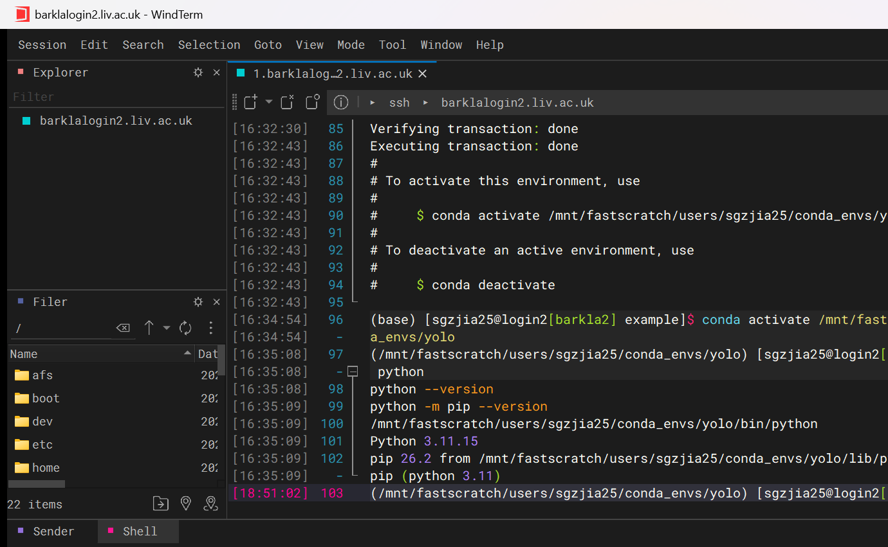

Run these lightweight checks:

```bash
whoami
hostname
pwd
```

Do not run model training directly on a login node. Login nodes are for file management, environment setup, lightweight checks and Slurm job submission.

---

## Step 3: Create the Project Directories

In WindTerm, define the project paths and create the required directories:

```bash
export PROJECT="/mnt/fastscratch/users/$USER/yolo_project"
export YOLO_ENV="/mnt/fastscratch/users/$USER/conda_envs/yolo"

mkdir -p "$PROJECT/dataset"
mkdir -p "$PROJECT/logs"
mkdir -p "$PROJECT/weights"

cd "$PROJECT"
pwd
```

For the example account, `pwd` should display:

```text
/mnt/fastscratch/users/sgzjia25/yolo_project
```


`fastscratch` is suitable for large datasets, checkpoints and training outputs, but it must not be treated as the only long-term backup location.

---

## Step 4: Connect to Barkla Using WinSCP

Open WinSCP:


Enter:

```text
File protocol: SFTP
Host name:     barklalogin2.liv.ac.uk
Port number:   22
User name:     your University username
Password:      your University password
```

Select `Save` if you want to retain the connection profile, then select `Login`. Avoid storing the password on a shared computer.

If WinSCP displays a host-key prompt, verify the fingerprint before accepting it.


After connecting:

- the left pane shows files on Windows;
- the right pane shows files on Barkla.

Files can now be dragged between the two systems.

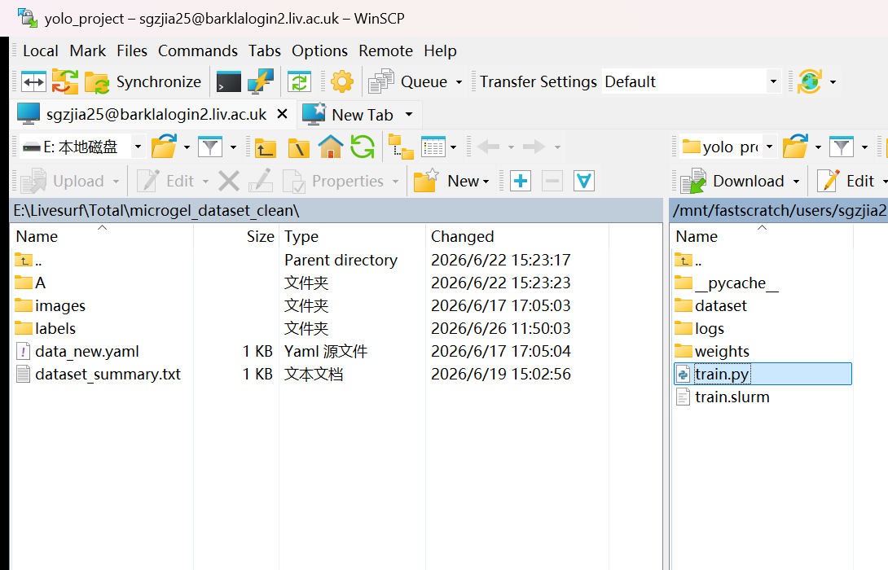

On the Barkla side, open:

```text
/mnt/fastscratch/users/sgzjia25/yolo_project
```

---

## Step 5: Prepare and Upload the YOLO Dataset

### 5.1 Required directory structure

A YOLO object-detection dataset should use this structure:

```text
yolo_project/
└── dataset/
    ├── images/
    │   ├── train/
    │   └── val/
    ├── labels/
    │   ├── train/
    │   └── val/
    └── data.yaml
```

An image containing objects must have a label file with the same base filename:

```text
images/train/image001.jpg
labels/train/image001.txt
```

Each line in a detection label file must use:

```text
class_id x_center y_center width height
```

Class IDs start at `0`. The four box coordinates must use normalised `xywh` values in the range `0–1`. An image containing no labelled objects may have no label file or an empty label file.

### 5.2 Upload the dataset

Use WinSCP to upload the four `train`/`val` directories into:

```text
/mnt/fastscratch/users/sgzjia25/yolo_project/dataset
```

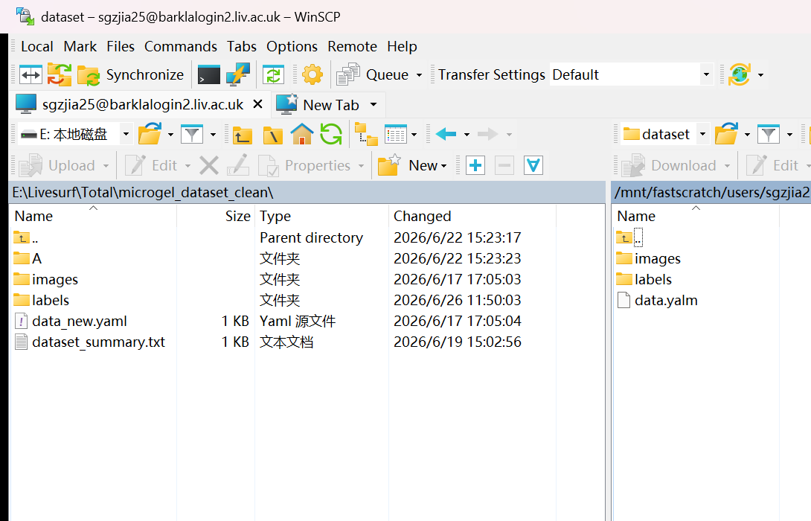

### 5.3 Create `data.yaml`

In WindTerm, run:

```bash
export PROJECT="/mnt/fastscratch/users/$USER/yolo_project"

cat > "$PROJECT/dataset/data.yaml" <<YAML
path: $PROJECT/dataset
train: images/train
val: images/val

names:
  0: microgel
YAML
```

The closing `YAML` line terminates the shell input and is not written into the file.

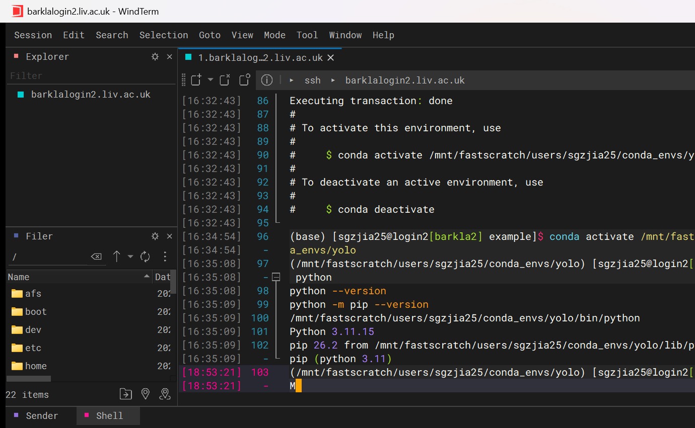

Display the file:

```bash
cat "$PROJECT/dataset/data.yaml"
```


The filename must be exactly `data.yaml`, not `data.yalm`.

---

## Step 6: Load the Miniforge Conda Module

Search the current module catalogue rather than assuming that an old module name still exists:

```bash
module --ignore-cache spider 2>&1 | grep -iE "anaconda|miniconda|miniforge|conda|python"
module spider miniforge3
```

The module recorded when this guide was prepared was:

```text
miniforge3/25.3.0-python3.12.10-dynamic
```

If it is still available, load it:

```bash
module load miniforge3/25.3.0-python3.12.10-dynamic
```

Barkla may print an informational message describing the dynamic Miniforge build. That message is not an error.

Confirm that Conda is available:

```bash
which conda
conda --version
```

The exact version may change. A valid path under `/opt/apps/` and a Conda version number indicate that the module loaded successfully.

If the recorded module is no longer present, use the exact current name returned by `module spider miniforge3` in this guide's later commands and in `train.slurm`.

---

## Step 7: Create the YOLO Conda Environment

Load Miniforge and initialise Conda in the current Bash shell:

```bash
module load miniforge3/25.3.0-python3.12.10-dynamic
eval "$(conda shell.bash hook)"
```

Create a directory for environments:

```bash
mkdir -p "/mnt/fastscratch/users/$USER/conda_envs"
```

Create a Python 3.11 environment:

```bash
conda create \
    -p "/mnt/fastscratch/users/$USER/conda_envs/yolo" \
    python=3.11 \
    pip \
    -y
```

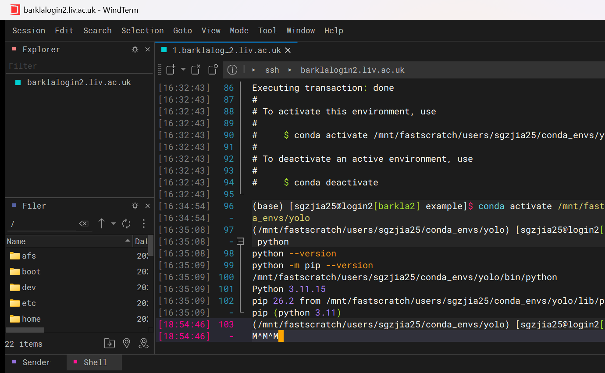

Activate it:

```bash
conda activate "/mnt/fastscratch/users/$USER/conda_envs/yolo"
```

Check the active Python installation:

```bash
which python
python --version
python -m pip --version
```

The output should be similar to:

```text
/mnt/fastscratch/users/sgzjia25/conda_envs/yolo/bin/python
Python 3.11.x
pip ... from /mnt/fastscratch/users/sgzjia25/conda_envs/yolo/lib/python3.11/site-packages/pip
```


If `which python` displays `/usr/bin/python`, stop and activate the Conda environment correctly before installing anything.

Create the environment only once. In later login sessions, use:

```bash
module load miniforge3/25.3.0-python3.12.10-dynamic
eval "$(conda shell.bash hook)"
conda activate "/mnt/fastscratch/users/$USER/conda_envs/yolo"
```

---

## Current Audited State Before Step 8

Current audited state:

- The environment, dataset, scripts and model weights were checked on Barkla.
- A first one-epoch test job, `10117422`, failed because the old submit command used `--export=ALL` and carried stale `SLURM_*` variables into the job.
- The submit command below is corrected. It uses a clean export and does not carry old Slurm variables.
- The corrected one-epoch test job is `10117602`. It was still `PENDING` at the final check on 4 August 2026 at 12:36.
- No production training job has been submitted. Submit production only after the one-epoch test job is `COMPLETED`.

Do not run YOLO training directly on a login node. Login nodes are only for file management, lightweight checks, environment setup and Slurm submission.

---

## Step 8: Install PyTorch and Ultralytics

### 8.1 Activate the YOLO environment

```bash
export PROJECT="/mnt/fastscratch/users/$USER/yolo_project"
export YOLO_ENV="/mnt/fastscratch/users/$USER/conda_envs/yolo"

module load miniforge3/25.3.0-python3.12.10-dynamic
eval "$(conda shell.bash hook)"
conda activate "$YOLO_ENV"

which python
python --version
python -m pip --version
```

Do not continue if `which python` points to `/usr/bin/python`.

### 8.2 Install and verify the packages

```bash
python -m pip install \
    torch==2.8.0 \
    torchvision==0.23.0 \
    --index-url https://download.pytorch.org/whl/cu128

python -m pip install ultralytics==8.4.102

python -m pip check
python -c "import torch; print('PyTorch:', torch.__version__); print('Built CUDA:', torch.version.cuda)"
python -c "import ultralytics; print('Ultralytics:', ultralytics.__version__)"
python -c "from ultralytics import YOLO; print('YOLO import successful')"
```

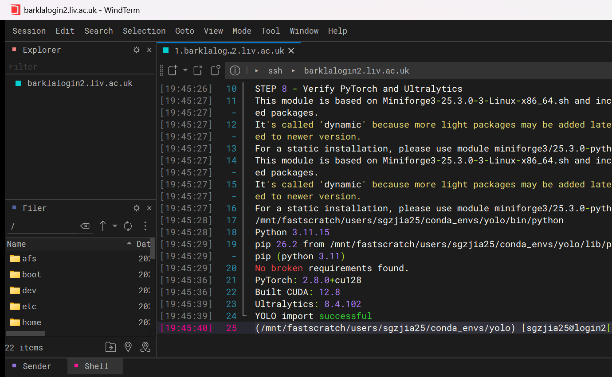

### 8.3 Record the environment

```bash
cd "$PROJECT"
python -m pip freeze > yolo_requirements.txt
grep -iE "torch|torchvision|ultralytics" yolo_requirements.txt
ls -lh yolo_requirements.txt
```

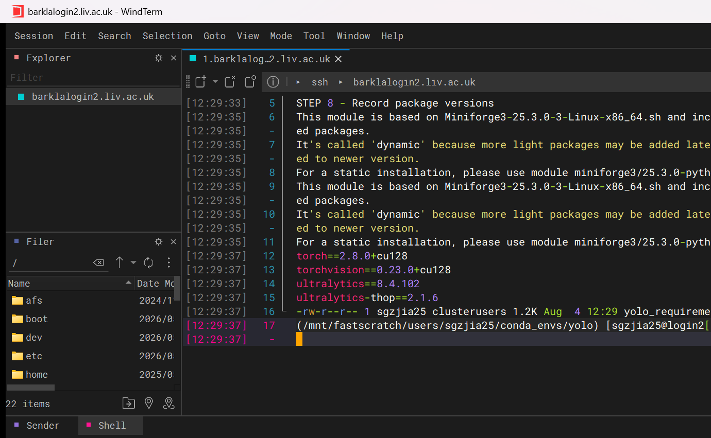

Keep `yolo_requirements.txt` with the final training results.

---

## Step 9: Check the Dataset and Download the Model Before Training

The final project dataset should be under:

```text
/mnt/fastscratch/users/sgzjia25/yolo_project/dataset
```

Run:

```bash
export PROJECT="/mnt/fastscratch/users/$USER/yolo_project"
cd "$PROJECT"

test -f dataset/data.yaml && echo "data.yaml OK"
test -d dataset/images/train && echo "training images OK"
test -d dataset/images/val && echo "validation images OK"
test -d dataset/labels/train && echo "training labels OK"
test -d dataset/labels/val && echo "validation labels OK"

echo -n "train images: "
find dataset/images/train -type f \( -iname '*.jpg' -o -iname '*.jpeg' -o -iname '*.png' -o -iname '*.tif' -o -iname '*.tiff' \) | wc -l

echo -n "train labels: "
find dataset/labels/train -type f -name '*.txt' | wc -l

echo -n "val images: "
find dataset/images/val -type f \( -iname '*.jpg' -o -iname '*.jpeg' -o -iname '*.png' -o -iname '*.tif' -o -iname '*.tiff' \) | wc -l

echo -n "val labels: "
find dataset/labels/val -type f -name '*.txt' | wc -l
```

The checked dataset contains:

```text
train images: 63
train labels: 63
val images:   18
val labels:   18
```

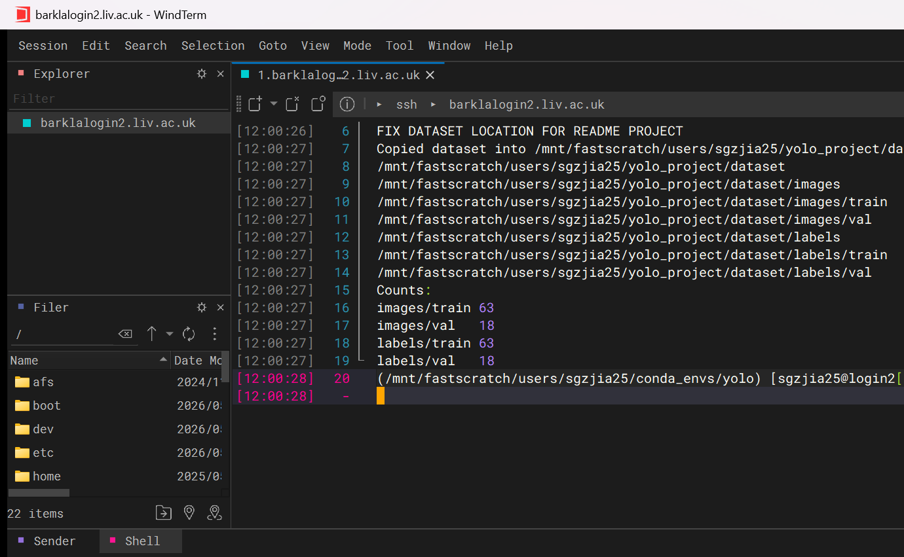

Download the model before requesting a GPU:

```bash
export YOLO_ENV="/mnt/fastscratch/users/$USER/conda_envs/yolo"
module load miniforge3/25.3.0-python3.12.10-dynamic
eval "$(conda shell.bash hook)"
conda activate "$YOLO_ENV"

cd "$PROJECT/weights"
python -c "from ultralytics import YOLO; YOLO('yolo26m.pt'); print('YOLO26m is ready')"
ls -lh yolo26m.pt
```

The checked file is:

```text
/mnt/fastscratch/users/sgzjia25/yolo_project/weights/yolo26m.pt
```

---

## Step 10: Create the Training Program (`train.py`)

Enter the project directory:

```bash
export PROJECT="/mnt/fastscratch/users/$USER/yolo_project"
cd "$PROJECT"
```

Create `train.py` using the checked training program. The local checked copy is:

```text
C:\Users\benef\Documents\Codex\2026-08-03\ban\work\remote_train.py
```

Important paths inside the script:

```python
PROJECT_ROOT = Path(__file__).resolve().parent
DATA_YAML = PROJECT_ROOT / "dataset" / "data.yaml"
MODEL_WEIGHTS = PROJECT_ROOT / "weights" / "yolo26m.pt"
RUNS_DIR = PROJECT_ROOT / "runs"
```

Check syntax after creating the file:

```bash
python -m py_compile train.py
ls -lh train.py
```

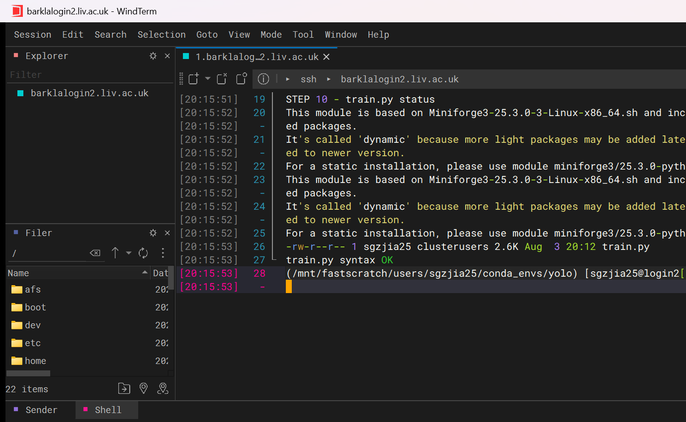

The script writes each Slurm run to:

```text
runs/microgel_yolo26m_JOBID
```

---

## Step 11: Check Barkla GPU Partitions and Modules

Check the live GPU partitions:

```bash
sinfo -o "%20P %15a %20G %15l" | grep -i gpu
```

Confirm the selected partition:

```bash
sinfo -p gpu-a-lowsmall
scontrol show partition gpu-a-lowsmall
```

Confirm the Miniforge module:

```bash
module spider miniforge3/25.3.0-python3.12.10-dynamic
```

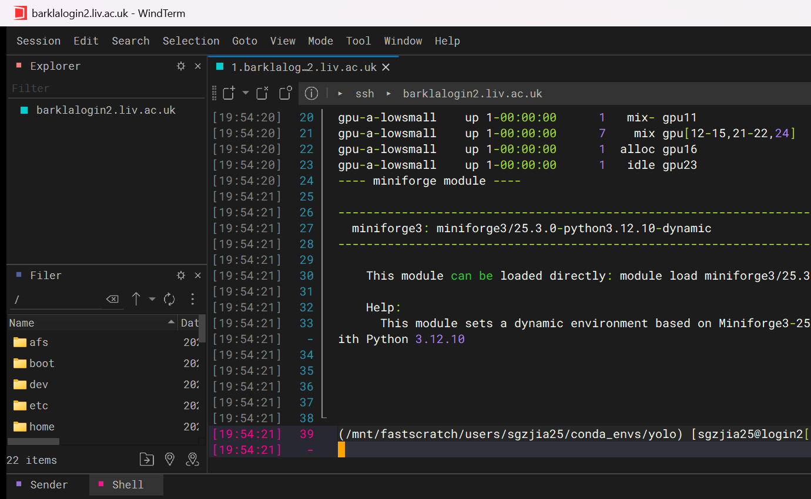

If a partition or module no longer exists, stop and use the exact live names returned by `sinfo` and `module spider`.

---

## Step 12: Create the Slurm Job Script (`train.slurm`)

Create the log directory and enter the project:

```bash
mkdir -p /mnt/fastscratch/users/sgzjia25/yolo_project/logs
cd /mnt/fastscratch/users/sgzjia25/yolo_project
```

Create `train.slurm` using the checked Slurm script. The local checked copy is:

```text
C:\Users\benef\Documents\Codex\2026-08-03\ban\work\remote_train.slurm
```

The checked script requests:

```text
partition: gpu-a-lowsmall
GPU:       1
CPUs:      4
memory:    32G
time:      24:00:00
```

Check the script:

```bash
bash -n train.slurm
grep -E "^#SBATCH --partition|^#SBATCH --gres|^#SBATCH --mem|^#SBATCH --time" train.slurm
```

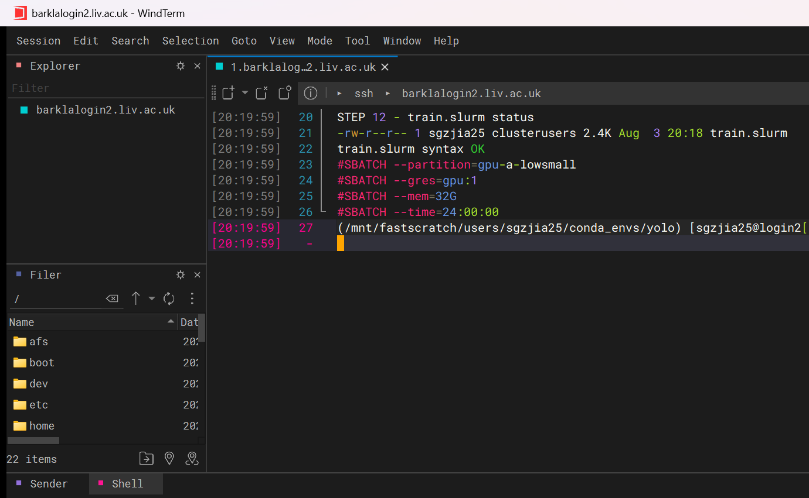

Do not add unverified CUDA modules. The PyTorch `cu128` wheel includes the CUDA runtime used by PyTorch.

---

## Step 13: Run Pre-submission Checks

Run these checks from the project directory:

```bash
export PROJECT="/mnt/fastscratch/users/$USER/yolo_project"
cd "$PROJECT"

python -m py_compile train.py && echo "train.py OK"
bash -n train.slurm && echo "train.slurm OK"
test -f dataset/data.yaml && echo "data.yaml OK"
test -s weights/yolo26m.pt && echo "model OK"
test -d dataset/images/train && echo "training images OK"
test -d dataset/images/val && echo "validation images OK"
test -d dataset/labels/train && echo "training labels OK"
test -d dataset/labels/val && echo "validation labels OK"
```

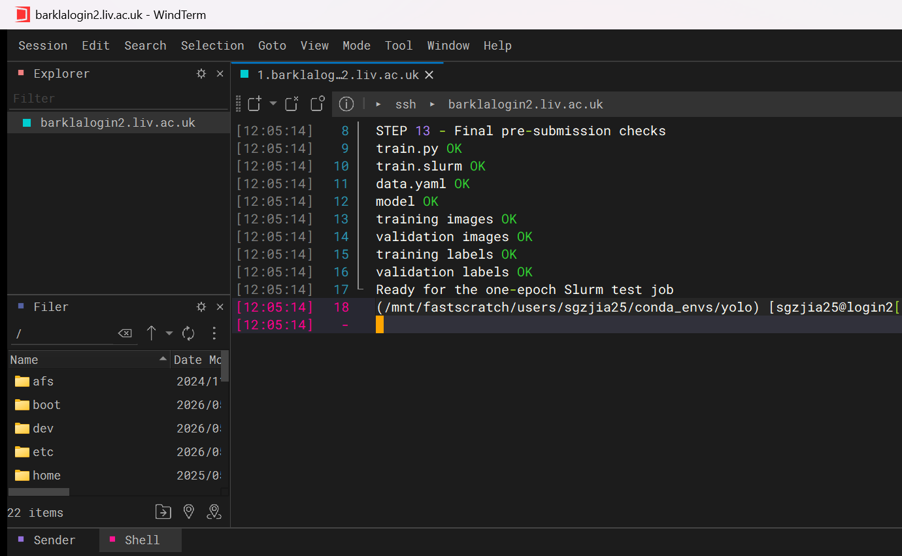

These checks do not train the model. They only confirm files, syntax, dataset folders and weights before Slurm submission.

---

## Step 14: Submit a Short One-epoch Test Job

Use a small test before production:

```text
epochs = 1
imgsz  = 640
batch  = 2
```

Submit with a clean export:

```bash
export PROJECT="/mnt/fastscratch/users/$USER/yolo_project"
cd "$PROJECT"

unset SLURM_CPUS_PER_TASK SLURM_TRES_PER_TASK

JOBID=$(sbatch --parsable \
    --export=YOLO_EPOCHS=1,YOLO_IMGSZ=640,YOLO_BATCH=2 \
    train.slurm)

JOBID="${JOBID%%;*}"
printf '%s\n' "$JOBID" > .last_job_id
echo "Submitted clean test job: $JOBID"

squeue -j "$JOBID" -o "%.12i %.14P %.16j %.10T %.8M %.12R"
```

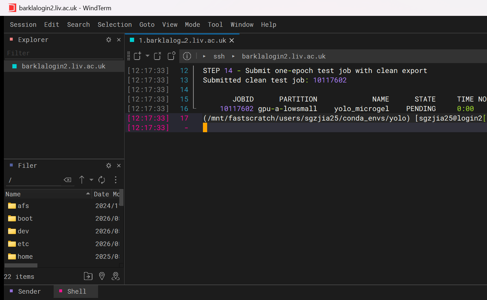

Do not use `--export=ALL` here. It can carry stale `SLURM_*` variables from the current shell and make `srun` fail.

---

## Step 15: Submit the Production Training Job

Do not run this step until the one-epoch test job is `COMPLETED`, the logs are clean, and the result files exist.

The current clean test job is still pending:

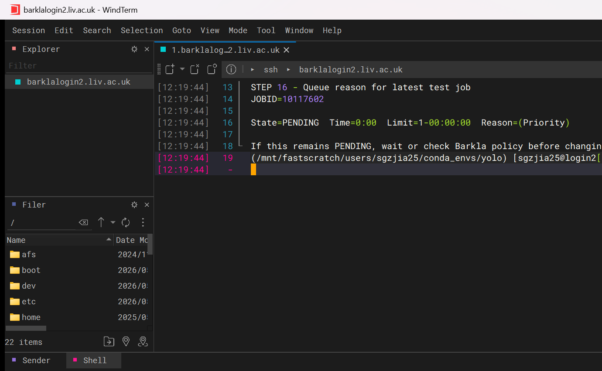

After the test passes, submit production with:

```bash
export PROJECT="/mnt/fastscratch/users/$USER/yolo_project"
cd "$PROJECT"

unset SLURM_CPUS_PER_TASK SLURM_TRES_PER_TASK

JOBID=$(sbatch --parsable train.slurm)
JOBID="${JOBID%%;*}"

printf '%s\n' "$JOBID" > .last_job_id
echo "Submitted production job: $JOBID"
```

For a conservative first production run:

```bash
JOBID=$(sbatch --parsable \
    --export=YOLO_EPOCHS=100,YOLO_IMGSZ=1280,YOLO_BATCH=-1 \
    train.slurm)

JOBID="${JOBID%%;*}"
printf '%s\n' "$JOBID" > .last_job_id
echo "Submitted production job: $JOBID"
```

---

## Step 16: Check the Job Status, Node and GPU

Restore the latest job ID:

```bash
export PROJECT="/mnt/fastscratch/users/$USER/yolo_project"
cd "$PROJECT"

JOBID=$(cat .last_job_id)
echo "JOBID=$JOBID"
```

Check Slurm:

```bash
squeue -j "$JOBID" -o "%.12i %.14P %.16j %.10T %.8M %.12R"
sacct -j "$JOBID" --format=JobID,JobName,State,Elapsed,ExitCode
```

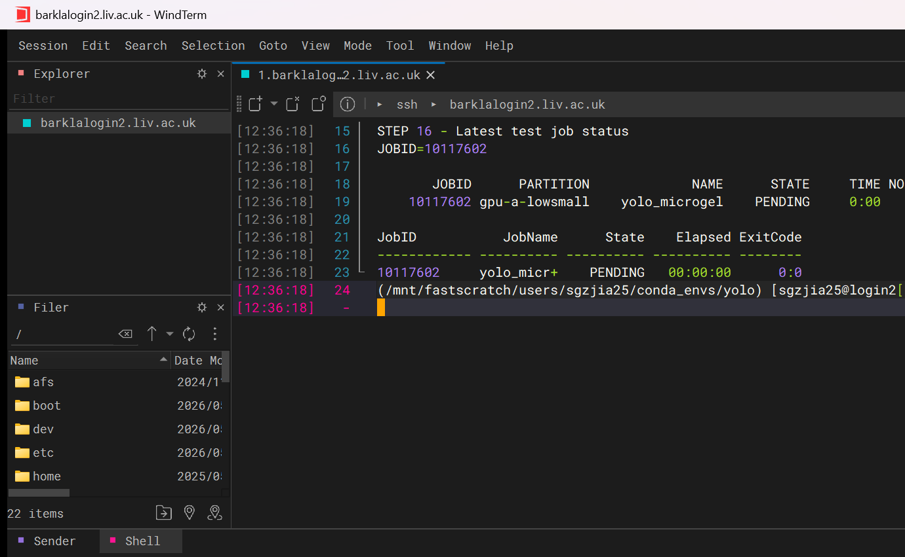

To show only the reason:

```bash
squeue -j "$JOBID" -h -o "State=%T  Time=%M  Limit=%l  Reason=%R"
```


If the job is `PENDING` with `(Priority)` or `(Resources)`, wait. Do not change resource requests unless Barkla policy and `sinfo` show that the change is appropriate.

When the job is running, identify the assigned node:

```bash
NODE=$(squeue -h -j "$JOBID" -t R -o "%N")
echo "Running node: $NODE"
```

If `node-usage.sh` is available:

```bash
node-usage.sh gpu | grep -E "^NODE|^----|^${NODE}[[:space:]]"
```

---

## Step 17: View the Logs

After the job starts:

```bash
export PROJECT="/mnt/fastscratch/users/$USER/yolo_project"
cd "$PROJECT"

JOBID=$(cat .last_job_id)
ls -lh logs/*"$JOBID"*
```

View output:

```bash
tail -f logs/yolo_microgel.*."$JOBID".out
```

View errors:

```bash
tail -f logs/yolo_microgel.*."$JOBID".err
```

Press `Ctrl+C` to stop following a log file. This does not cancel the Slurm job.

The screenshot below shows the log-checking method. It is from the first failed test job, `10117422`; the corrected test job `10117602` had not started yet when checked.

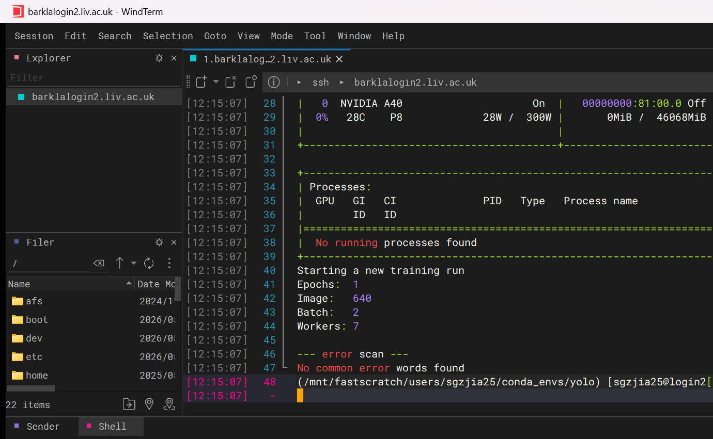

The failure diagnosis showed the old `--export=ALL` problem:

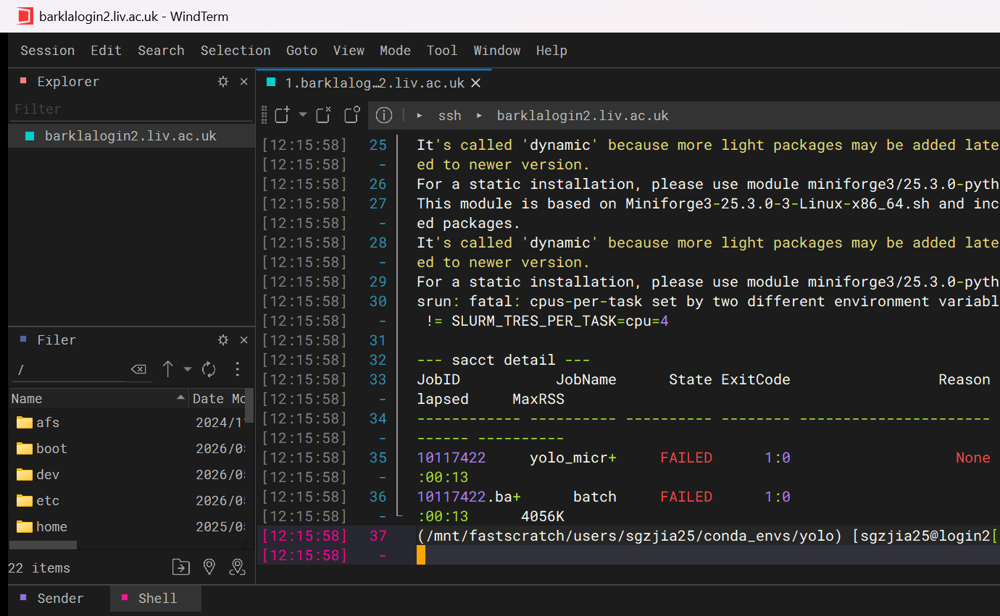

For the corrected job, the beginning of a healthy log should include:

```text
CUDA available: True
GPU: NVIDIA ...
Starting a new training run
```

---

## Step 18: Check Completion, Resume or Cancel

Check the final state:

```bash
JOBID=$(cat .last_job_id)
sacct -j "$JOBID" --format=JobID,JobName,Partition,State,Elapsed,MaxRSS,ExitCode
```

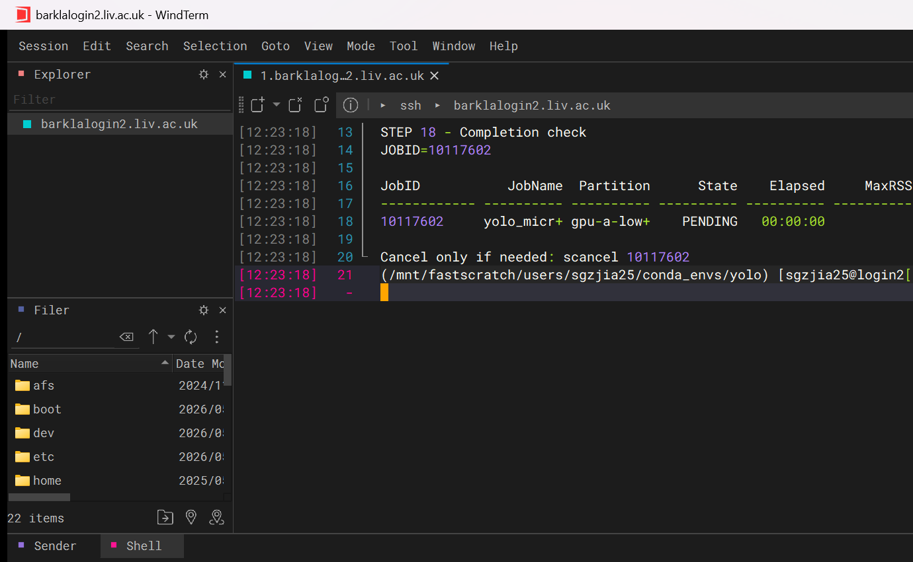

Only proceed if the main job row says:

```text
COMPLETED
```

To resume an interrupted run:

```bash
export PROJECT="/mnt/fastscratch/users/$USER/yolo_project"
cd "$PROJECT"

OLD_JOBID=123456
LAST_PT="$PROJECT/runs/microgel_yolo26m_${OLD_JOBID}/weights/last.pt"
test -s "$LAST_PT" && echo "Checkpoint found: $LAST_PT"

JOBID=$(sbatch --parsable \
    --export=YOLO_RESUME="$LAST_PT" \
    train.slurm)

JOBID="${JOBID%%;*}"
printf '%s\n' "$JOBID" > .last_job_id
echo "Submitted resume job: $JOBID"
```

Use `last.pt`, not `best.pt`, when resuming an interrupted training state.

Cancel only a specific job when needed:

```bash
scancel "$JOBID"
squeue -j "$JOBID"
```

Do not use `scancel -u "$USER"` unless you truly intend to cancel every queued and running job owned by the account.

---

## Step 19: Locate and Verify the Training Results

After the job is complete:

```bash
export PROJECT="/mnt/fastscratch/users/$USER/yolo_project"
cd "$PROJECT"

JOBID=$(cat .last_job_id)
RUN_DIR="$PROJECT/runs/microgel_yolo26m_${JOBID}"

find "$RUN_DIR" -maxdepth 2 -type f | sort
ls -lh "$RUN_DIR/weights"
```

Current checked state: the corrected test job was still pending, so the run directory had not been created yet.

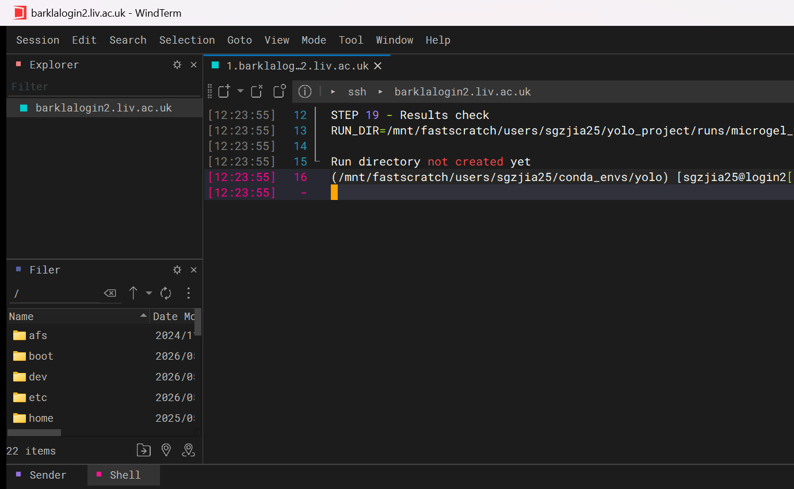

After a successful run, verify:

```text
weights/best.pt
weights/last.pt
results.csv
results.png
args.yaml
```

Also confirm that:

- `sacct` reports `COMPLETED`;
- logs contain no traceback, out-of-memory message or silent early termination;
- `best.pt` is not empty;
- validation predictions make sense for the scientific task.

---

## Step 20: Download Results with WinSCP

Open WinSCP and go to the project:

```text
/mnt/fastscratch/users/sgzjia25/yolo_project
```


After the completed run creates a result directory, open:

```text
/mnt/fastscratch/users/sgzjia25/yolo_project/runs/microgel_yolo26m_JOBID
```

Download at least:

```text
weights/best.pt
weights/last.pt
results.csv
results.png
confusion_matrix.png
PR_curve.png
F1_curve.png
args.yaml
```

Also keep the matching setup files:

```text
train.py
train.slurm
dataset/data.yaml
yolo_requirements.txt
```

`fastscratch` should not be the only copy of important results. Download results promptly or move them to University-approved long-term storage.


