# Complete Guide: Windows to Barkla HPC to YOLO Training

Last audited: 4 August 2026

This README is a step-by-step Windows -> Barkla HPC -> YOLO training guide for the microgel dataset. The screenshots in `screenshots_steps/` were rechecked before upload; old cropped or mismatched screenshots were removed from the GitHub version.

## Current Audited State

Use this section before following the later training steps.

- Barkla username: use your own University username.
- Project directory: `/mnt/fastscratch/users/$USER/yolo_project`
- Dataset source directory example: `/mnt/fastscratch/users/$USER/yolo_train/microgel_dataset_clean`
- Project dataset links: `dataset/images` and `dataset/labels` point to the dataset source directory above.
- `train.py` is present on Barkla and passes `python -m py_compile train.py`.
- Dataset check passed after linking: 63 train images, 63 train labels, 18 validation images, 18 validation labels.
- `weights/yolo26m.pt` exists.
- Final pre-submission check passed and printed `READY_FOR_SBATCH train.slurm`.
- A one-epoch Slurm test completed successfully on Barkla: `COMPLETED`, exit code `0:0`.
- Test output exists under `$PROJECT/runs/microgel_yolo26m/`, including `best.pt`, `last.pt`, `results.csv`, `results.png`, and `args.yaml`.

The one-epoch Slurm test has completed. For a longer training run, increase training settings only as allowed by your course, supervisor, and Barkla usage rules. Do not run YOLO training directly on a login node.

## Step 1: Install or Open WinSCP and WindTerm

Install these tools on Windows:

- WinSCP: <https://winscp.net/eng/download.php>
- WindTerm: <https://github.com/kingToolbox/WindTerm/releases>

WinSCP is used for file upload/download. WindTerm is used for SSH commands on Barkla.

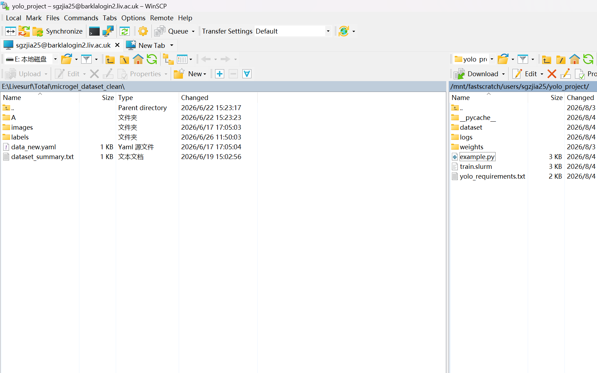

## Step 2: Connect to Barkla with WindTerm

Create an SSH session in WindTerm:

```text
Host: barklalogin2.liv.ac.uk
Port: 22
Username: your University username
```

Enter your University password and complete any required MFA. If you are off campus and the connection fails, connect to the University VPN first.

After login, run only lightweight checks:

```bash
whoami
hostname
pwd
```

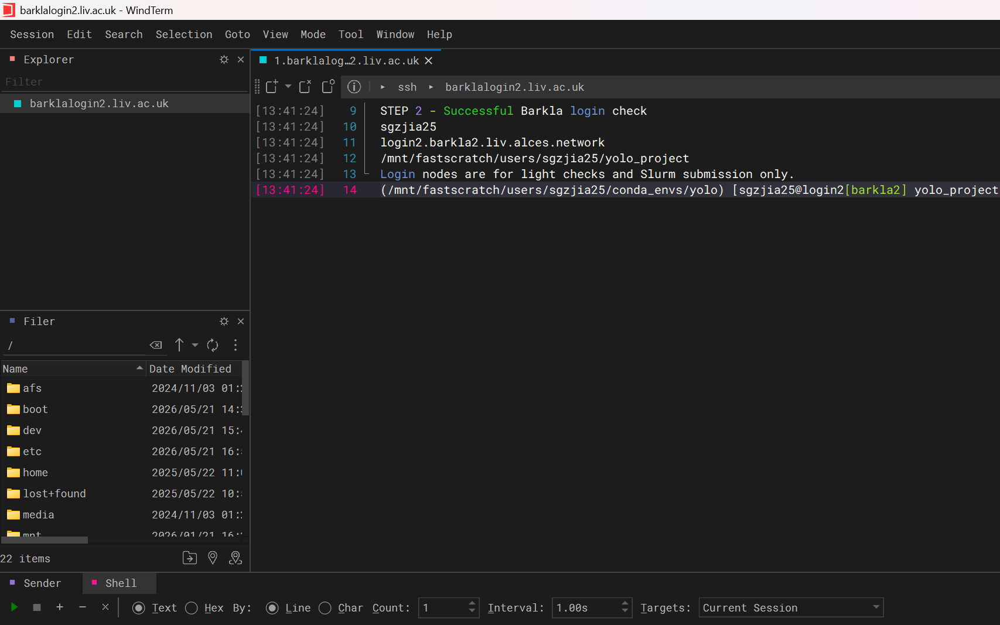

Login nodes are for file management, environment setup, short checks and Slurm submission. Training must run through Slurm.

## Step 3: Create the Project Directory

Create the project folders on `fastscratch`:

```bash
export PROJECT="/mnt/fastscratch/users/$USER/yolo_project"
export YOLO_ENV="/mnt/fastscratch/users/$USER/conda_envs/yolo"

mkdir -p "$PROJECT/dataset"
mkdir -p "$PROJECT/logs"
mkdir -p "$PROJECT/weights"

cd "$PROJECT"
pwd
ls -lh
```

For this account, the project path is:

```text
/mnt/fastscratch/users/$USER/yolo_project
```

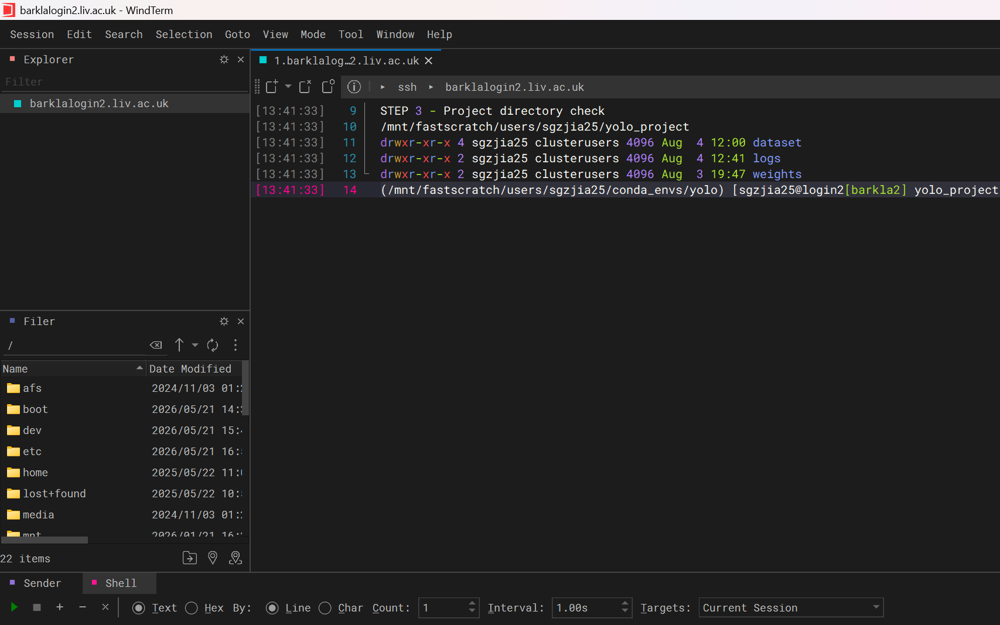

`fastscratch` is suitable for datasets, checkpoints and outputs, but it should not be the only long-term copy of important results.

## Step 4: Connect with WinSCP and Upload the Dataset

Open WinSCP and connect with SFTP:

```text
File protocol: SFTP
Host name:     barklalogin2.liv.ac.uk
Port number:   22
User name:     your University username
Password:      your University password
```

On the remote side, open or create the dataset source folder:

```text
/mnt/fastscratch/users/$USER/yolo_train/microgel_dataset_clean
```

Upload the dataset into that folder. The checked dataset is already there:

```text
/mnt/fastscratch/users/$USER/yolo_train/microgel_dataset_clean
```

Required YOLO structure:

```text
microgel_dataset_clean/
  images/
    train/
    val/
  labels/
    train/
    val/
```

Link the dataset into the project directory so `train.py` can use the same stable project paths:

```bash
export PROJECT="/mnt/fastscratch/users/$USER/yolo_project"
export DATA="/mnt/fastscratch/users/$USER/yolo_train/microgel_dataset_clean"

mkdir -p "$PROJECT/dataset"
ln -sfn "$DATA/images" "$PROJECT/dataset/images"
ln -sfn "$DATA/labels" "$PROJECT/dataset/labels"
ls -l "$PROJECT/dataset"
```

The WinSCP screenshot is only for the file-transfer interface. Script existence is verified later in WindTerm.


## Step 5: Create and Check `data.yaml`

Create `dataset/data.yaml`:

```bash
export PROJECT="/mnt/fastscratch/users/$USER/yolo_project"

cat > "$PROJECT/dataset/data.yaml" <<YAML
path: $PROJECT/dataset
train: images/train
val: images/val

names:
  0: microgel
YAML
```

If the dataset is stored in `/mnt/fastscratch/users/$USER/yolo_train/microgel_dataset_clean`, the links from Step 4 make `images/train`, `images/val`, `labels/train`, and `labels/val` appear under `$PROJECT/dataset`.

Check it:

```bash
cat "$PROJECT/dataset/data.yaml"
test -f "$PROJECT/dataset/data.yaml" && echo "data.yaml OK"
```

The filename must be exactly `data.yaml`, not `data.yalm`.

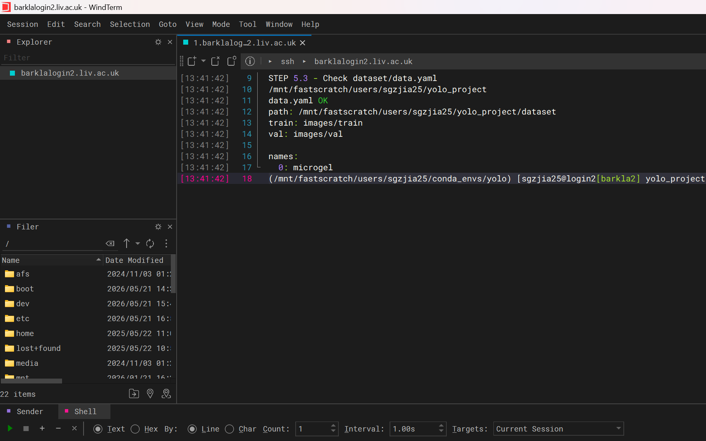

## Step 6: Load the Miniforge Conda Module

Check the live module name first:

```bash
module --ignore-cache spider 2>&1 | grep -iE "anaconda|miniconda|miniforge|conda|python"
module spider miniforge3
```

The checked module was:

```text
miniforge3/25.3.0-python3.12.10-dynamic
```

Load it and verify Conda:

```bash
module load miniforge3/25.3.0-python3.12.10-dynamic
which conda
conda --version
```

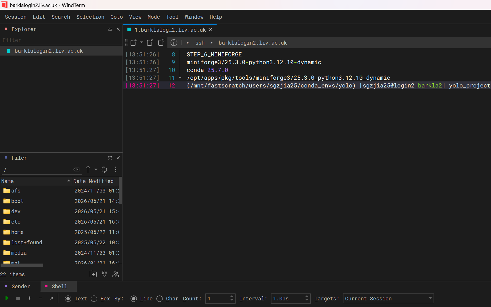

If Barkla changes the module name, use the current name returned by `module spider`.

## Step 7: Create or Activate the YOLO Conda Environment

Create the environment once:

```bash
module load miniforge3/25.3.0-python3.12.10-dynamic
eval "$(conda shell.bash hook)"

mkdir -p "/mnt/fastscratch/users/$USER/conda_envs"

conda create \
    -p "/mnt/fastscratch/users/$USER/conda_envs/yolo" \
    python=3.11 \
    pip \
    -y
```

In later sessions, activate it:

```bash
module load miniforge3/25.3.0-python3.12.10-dynamic
eval "$(conda shell.bash hook)"
conda activate "/mnt/fastscratch/users/$USER/conda_envs/yolo"

which python
python --version
python -m pip --version
```

Do not continue if `which python` points to `/usr/bin/python`.

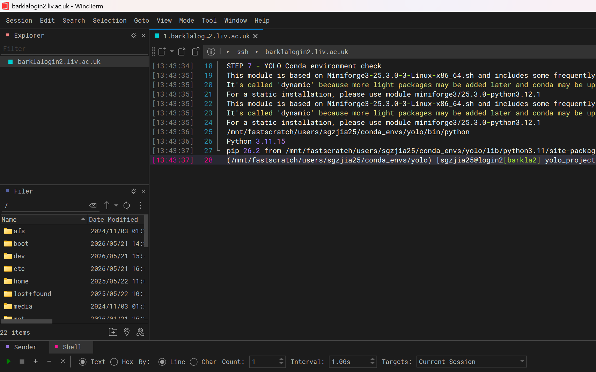

## Step 8: Install and Verify PyTorch and Ultralytics

Activate the environment:

```bash
export PROJECT="/mnt/fastscratch/users/$USER/yolo_project"
export YOLO_ENV="/mnt/fastscratch/users/$USER/conda_envs/yolo"

module load miniforge3/25.3.0-python3.12.10-dynamic
eval "$(conda shell.bash hook)"
conda activate "$YOLO_ENV"
```

Install:

```bash
python -m pip install \
    torch==2.8.0 \
    torchvision==0.23.0 \
    --index-url https://download.pytorch.org/whl/cu128

python -m pip install ultralytics==8.4.102
```

Verify:

```bash
python -m pip check
python -c "import torch; print('PyTorch:', torch.__version__); print('Built CUDA:', torch.version.cuda)"
python -c "import ultralytics; print('Ultralytics:', ultralytics.__version__)"
python -c "from ultralytics import YOLO; print('YOLO import successful')"
```

Record the environment:

```bash
cd "$PROJECT"
python -m pip freeze > yolo_requirements.txt
grep -iE "torch|torchvision|ultralytics" yolo_requirements.txt
```

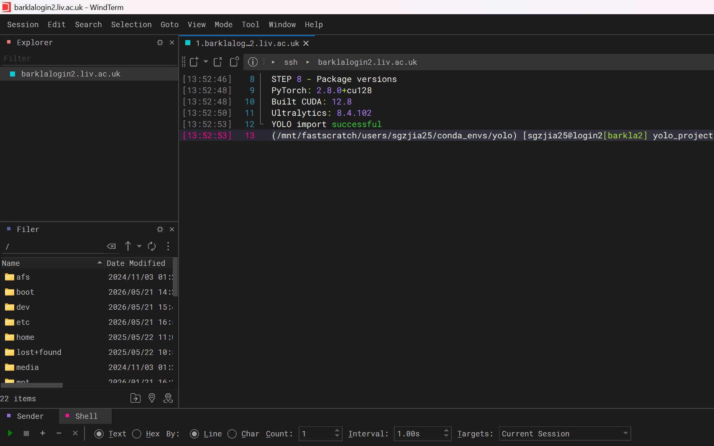

## Step 9: Check Dataset Counts and Model Weights

Run:

```bash
export PROJECT="/mnt/fastscratch/users/$USER/yolo_project"
cd "$PROJECT"

test -f dataset/data.yaml && echo "data.yaml OK"
test -d dataset/images/train && echo "training images OK"
test -d dataset/images/val && echo "validation images OK"
test -d dataset/labels/train && echo "training labels OK"
test -d dataset/labels/val && echo "validation labels OK"

echo -n "train images: "
find dataset/images/train -type f \( -iname '*.jpg' -o -iname '*.jpeg' -o -iname '*.png' -o -iname '*.tif' -o -iname '*.tiff' \) | wc -l

echo -n "train labels: "
find dataset/labels/train -type f -name '*.txt' | wc -l

echo -n "val images: "
find dataset/images/val -type f \( -iname '*.jpg' -o -iname '*.jpeg' -o -iname '*.png' -o -iname '*.tif' -o -iname '*.tiff' \) | wc -l

echo -n "val labels: "
find dataset/labels/val -type f -name '*.txt' | wc -l
```

Checked counts:

```text
train images: 63
train labels: 63
val images:   18
val labels:   18
```

These counts were checked through the project links to:

```text
/mnt/fastscratch/users/$USER/yolo_train/microgel_dataset_clean
```

Download or verify the pretrained model before requesting a GPU:

```bash
cd "$PROJECT/weights"
python -c "from ultralytics import YOLO; YOLO('yolo26m.pt'); print('YOLO26m is ready')"
ls -lh yolo26m.pt
```

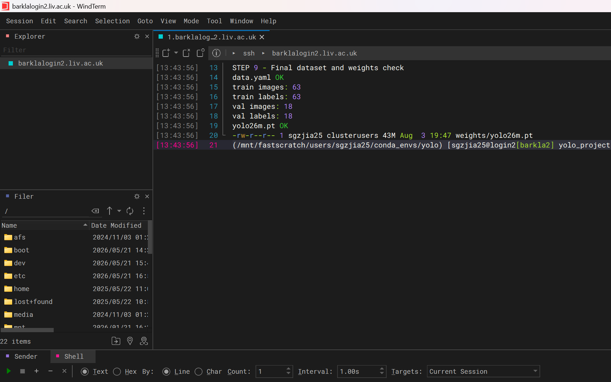

## Step 10: Create and Check `train.py`

Use the `train.py` file included in this repository, or create the same file in:

```text
/mnt/fastscratch/users/$USER/yolo_project/train.py
```

Important paths inside the script:

```python
PROJECT_ROOT = Path(__file__).resolve().parent
DATA_YAML = PROJECT_ROOT / "dataset" / "data.yaml"
MODEL_WEIGHTS = PROJECT_ROOT / "weights" / "yolo26m.pt"
RUNS_DIR = PROJECT_ROOT / "runs"
```

Check:

```bash
cd "/mnt/fastscratch/users/$USER/yolo_project"
ls -lh train.py example.py train.slurm yolo_requirements.txt
python -m py_compile train.py && echo "train.py syntax OK"
```

Earlier, `train.py` was missing on Barkla. It was restored from the existing `example.py`, and the syntax check now passes.

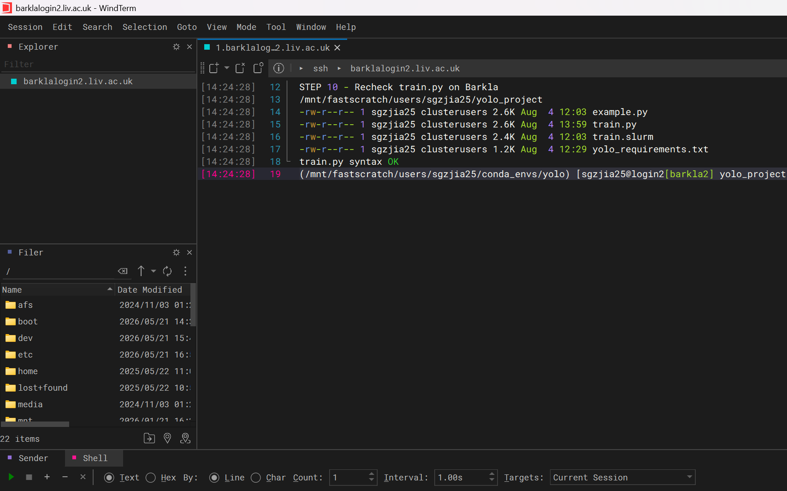

## Step 11: Check GPU Partition and Module Names

Check the live GPU partitions:

```bash
sinfo -o "%20P %15a %20G %15l" | grep -i gpu
sinfo -p gpu-a-lowsmall
scontrol show partition gpu-a-lowsmall
```

Check the module:

```bash
module spider miniforge3/25.3.0-python3.12.10-dynamic
```

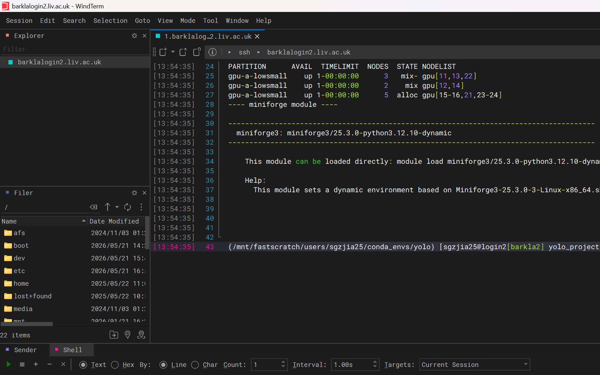

If a partition or module no longer exists, stop and use the exact current Barkla name.

## Step 12: Create or Update `train.slurm`

Use the `train.slurm` file included in this repository as the template. It requests:

```text
partition: gpu-a-lowsmall
GPU:       1
CPUs:      4
memory:    32G
time:      24:00:00
```

Important: this README template launches the Python program directly inside the Slurm batch allocation:

```bash
python -u train.py --epochs "$EPOCHS" --imgsz "$IMGSZ" --batch "$BATCH" --workers "$WORKERS"
```

It does not use a nested `srun python ...` line for the Python training command. A previous nested `srun` form caused a Slurm CPU environment conflict during testing.

If your remote `train.slurm` still contains `srun python`, back it up and replace only that launcher:

```bash
cd "/mnt/fastscratch/users/$USER/yolo_project"
cp -p train.slurm train.slurm.backup_20260804
perl -0pi -e 's/\bsrun python -u train\.py\b/python -u train.py/g' train.slurm
bash -n train.slurm
grep -nE 'python -u train.py|srun python|cpus-per-task' train.slurm
```


## Step 13: Run Final Pre-submission Checks

These checks do not train the model:

```bash
export PROJECT="/mnt/fastscratch/users/$USER/yolo_project"
missing=0

check_file() {
    test -s "$1" && echo "OK: $2" || { echo "MISSING: $2 ($1)"; missing=1; }
}

check_dir() {
    test -d "$1" && echo "OK: $2" || { echo "MISSING: $2 ($1)"; missing=1; }
}

python -m py_compile "$PROJECT/train.py" && echo "OK: train.py syntax"
bash -n "$PROJECT/train.slurm" && echo "OK: train.slurm syntax"
check_file "$PROJECT/dataset/data.yaml" "data.yaml"
check_file "$PROJECT/weights/yolo26m.pt" "model weights"
check_dir "$PROJECT/dataset/images/train" "training images"
check_dir "$PROJECT/dataset/images/val" "validation images"
check_dir "$PROJECT/dataset/labels/train" "training labels"
check_dir "$PROJECT/dataset/labels/val" "validation labels"

if [ "$missing" -eq 0 ]; then
    echo "Ready for sbatch train.slurm"
else
    echo "NOT READY: fix the missing files above before sbatch"
fi
```

Only continue if every line is `OK` and the final line says `Ready for sbatch train.slurm`.

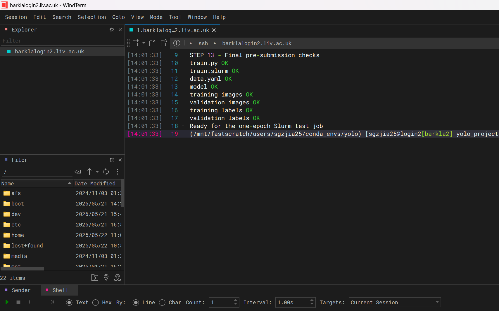

## Step 14: Submit the Slurm Job

At this point, the normal workflow only needs two files:

- `train.py`
- `train.slurm`

Minimal `train.py` example:

```python
import argparse
from pathlib import Path

from ultralytics import YOLO

parser = argparse.ArgumentParser()
parser.add_argument("--epochs", type=int, default=1)
parser.add_argument("--imgsz", type=int, default=640)
parser.add_argument("--batch", type=int, default=2)
args = parser.parse_args()

ROOT = Path(__file__).resolve().parent

model = YOLO(str(ROOT / "weights" / "yolo26m.pt"))
model.train(
    data=str(ROOT / "dataset" / "data.yaml"),
    epochs=args.epochs,
    imgsz=args.imgsz,
    batch=args.batch,
    device=0,
    project=str(ROOT / "runs"),
    name="microgel_yolo26m",
)
```

Minimal `train.slurm` example:

```bash
#!/bin/bash -l
#SBATCH --job-name=yolo_microgel
#SBATCH --partition=gpu-a-lowsmall
#SBATCH --nodes=1
#SBATCH --ntasks=1
#SBATCH --gres=gpu:1
#SBATCH --cpus-per-task=4
#SBATCH --mem=32G
#SBATCH --time=24:00:00
#SBATCH --output=logs/%x.%N.%j.out
#SBATCH --error=logs/%x.%N.%j.err

PROJECT="/mnt/fastscratch/users/$USER/yolo_project"
YOLO_ENV="/mnt/fastscratch/users/$USER/conda_envs/yolo"
EPOCHS=1
IMGSZ=640
BATCH=2

module purge
module load miniforge3/25.3.0-python3.12.10-dynamic
eval "$(conda shell.bash hook)"
conda activate "$YOLO_ENV"

cd "$PROJECT"
python -u train.py --epochs "$EPOCHS" --imgsz "$IMGSZ" --batch "$BATCH"
```

After this small test works, increase `EPOCHS`, `IMGSZ`, and `BATCH` in `train.slurm` for the real run.

Submit the job:

```bash
export PROJECT="/mnt/fastscratch/users/$USER/yolo_project"
cd "$PROJECT"

sbatch train.slurm
```

Slurm will print a job ID, for example:

```text
Submitted batch job 12345678
```

## Step 15: Check Whether Training Has Started

Use:

```bash
squeue --me
```

Useful states:

```text
PD  pending, waiting in the queue
R   running
CG  completing
```

If it is running, check the log files:

```bash
cd "/mnt/fastscratch/users/$USER/yolo_project"
ls -lh logs/
tail -n 80 logs/*.out
tail -n 80 logs/*.err
```

If `logs/*.err` shows a clear error, fix that before submitting again.

## Step 16: Optional GPU Usage Check

`node-usage.sh` is this helper script:

<https://gist.github.com/gmiklosic/f616f223afb783f77abf2e9f7f142778>

It is optional. Use it only to check Slurm node/GPU usage; it does not start training.

If `node-usage.sh` is already available on Barkla, run:

```bash
node-usage.sh gpu
```

If it is not available, read the gist first. If your course or group allows local helper scripts, save the gist content as `node-usage.sh` in your project directory:

```bash
cd "/mnt/fastscratch/users/$USER/yolo_project"
chmod +x node-usage.sh
./node-usage.sh gpu
```

## Step 17: Wait for the Job to Finish

Keep checking:

```bash
squeue --me
```

When your job disappears from `squeue --me`, check the final state:

```bash
sacct --format=JobID,JobName,Partition,State,Elapsed,ExitCode -u "$USER" | tail -n 20
```

Only trust the run if the main job row says `COMPLETED` and the error log is clean.

## Step 18: Find the Output Folder

The Python script writes YOLO output under:

```text
/mnt/fastscratch/users/$USER/yolo_project/runs/
```

The completed one-epoch test wrote output to:

```text
/mnt/fastscratch/users/$USER/yolo_project/runs/microgel_yolo26m/
```

Check:

```bash
cd "/mnt/fastscratch/users/$USER/yolo_project"
find runs -maxdepth 3 -type f | sort | tail -n 40
ls -lh runs/*/weights/
```

Important result files usually include:

```text
weights/best.pt
weights/last.pt
results.csv
results.png
args.yaml
```

## Step 19: Download Results with WinSCP

Open WinSCP and go to:

```text
/mnt/fastscratch/users/$USER/yolo_project/runs/
```

Drag the finished run folder from Barkla to your own computer.

Also download these setup files so the result can be reproduced later:

```text
train.py
train.slurm
dataset/data.yaml
yolo_requirements.txt
```

## Step 20: View the Output on Your Computer

On Windows, open the downloaded files:

```text
results.png
results.csv
confusion_matrix.png
PR_curve.png
F1_curve.png
weights/best.pt
weights/last.pt
```

Use `best.pt` for inference/evaluation. Keep `last.pt` if you may need to resume training later.

## Quick Safety Checklist

- Do not run YOLO training on login nodes.
- Use Slurm for GPU compute.
- Start with a one-epoch test.
- Do not submit production until the test job is `COMPLETED`.
- If a Slurm or policy error repeats, stop and ask Barkla support or your supervisor.
- Keep screenshots and README text synchronized with the real job state.

# LivSURF Microgel Detection Project | Handover Guide

Last verified: 2 August 2026  
Project directory: `E:\Livesurf\Total`  

## 1. Start Here

This project uses Ultralytics YOLO26m to detect microgels in microscopy images. The aim is to produce detection boxes that can support particle counting and, later, diameter measurement.

The model used in the current presentation is **Exp16**:

- Weights: `Exp16/weights/best.pt`
- Dataset: `microgel_dataset_clean/data_new.yaml`
- Image size: 1920
- Thresholds used in the presentation: `conf=0.50`, `NMS IoU=0.80`
- Validation metrics: Precision 0.9580, Recall 0.9180, F1 0.9376, mAP50 0.9766, mAP50-95 0.8732
- Prediction examples: `runs/detect/Exp16_prediction`
- Scope of selection: Exp16 is the current preferred model **within the Exp11–Exp16 stage**. It is not the model with the highest mAP50-95 across all historical single-class experiments.

Exp5 and Exp6 achieved higher metrics in the historical single-class route. Their weights are under `E:\Livesurf\Now_model`, outside this directory:

| Model | Weight location | conf | IoU | mAP50-95 | Notes |
|---|---|---:|---:|---:|---|
| Exp5 | `E:\Livesurf\Now_model\Exp5\weights\best.pt` | 0.50 | 0.80 | 0.9080 | Strong historical single-class baseline |
| Exp6 | `E:\Livesurf\Now_model\Exp6\weights\best.pt` | 0.45 | 0.80 | 0.9077 | Strong baseline without mosaic or flipping |
| Exp16 | `Exp16\weights\best.pt` | 0.50 | 0.80 | 0.8732 | Current presentation model; balanced-fitness route |

Do not choose the final model from one metric alone. The practical objective is “one suitable box per particle”, so missed detections, reflection-related false positives, duplicate boxes, edge fit, counting error and diameter error must also be checked.

## 2. Recommended Handover Order

1. Read this README first.
2. Open `EXP_yolo_latest.xlsx`, focusing on `Sheet1` and `Rename Map`.
3. Inspect `Exp16/weights/best.pt` and `runs/detect/Exp16_prediction`.
4. Read `threshold_search_results/best_thresholds_summary.csv`, then inspect individual model CSV files as needed.
5. Confirm the Python, PyTorch, CUDA and Ultralytics versions before running any training or threshold search.
6. Reproduce the Exp16 validation once before attempting to retrain all models.
7. Prioritise count-error and diameter-error validation on an independent test set.
8. Complete Section 11 after the HPC/HTC environment has been inspected directly.

## 3. Directory Map

| Path | Contents | Importance |
|---|---|---|
| `EXP_yolo_latest.xlsx` | Experiment index, metrics, code fragments and rename records for Exp1–Exp19 | Critical experiment register |
| `Exp1`–`Exp4`, `Exp9`, `Exp10` | Standard training outputs: arguments, curves, result CSVs, validation images and weights | Important historical experiments |
| `Exp13`–`Exp16` | Hyperparameter-tuning outputs: best parameters, tuning records, plots and weights | Important later experiments |
| `microgel_dataset_clean` | Current 1920×1200 single-class main dataset | Critical |
| `microgel_dataset_clean_640` | Derived 640×640 dataset sliced from the main dataset | Derived and rebuildable |
| `threshold_search_results` | Per-model confidence/NMS-IoU searches and combined summary | Critical |
| `runs/detect` | Prediction images and prediction TXT files from different models | Important visual-validation evidence |
| `images`, `labels` | Earlier 59/10-image data version | Historical; not the current default dataset |
| `microgel_dataset_clean_1920` | Older training run not mapped into the current Exp numbering | Historical; do not delete yet |
| `.codex_exp16_update` | Inspection, preview and QA intermediates created while updating the presentation | Not a training input; rebuildable |
| `LivSURF_Microgel_Detection_Presentation_10min_Exp16_updated.pptx` | Current 10-minute project presentation | Important presentation material |
| `LivSURF_Microgel_Detection_Presentation_10min_Exp16_updated.pdf` | PDF version of the presentation | Important for distribution |

The `Total` directory currently contains approximately 2,338 files and occupies about 1.43 GB. Most of the space is used by model weights, datasets and prediction images.

## 4. Datasets

### 4.1 Current Main Dataset

Configuration: `microgel_dataset_clean/data_new.yaml`

| Split | Images | Label files | Microgel boxes | Pairing status |
|---|---:|---:|---:|---|
| train | 63 | 63 | 10,161 | Complete |
| val | 18 | 18 | 2,511 | Complete |
| Total | 81 | 81 | 12,672 | Complete |

The dataset contains only class `0: microgel`.

Important: `microgel_dataset_clean/dataset_summary.txt` reports 14 validation images and 2,075 validation boxes. Those figures are outdated. The current directory contains **18 validation images and 2,511 validation boxes**. Future work should use the actual files or a fresh recount as the source of truth, and the summary should be updated whenever the dataset changes.

The source note states that the original annotations came from JSON files under `E:\Livesurf\TEST_yolo_bright\images\test`, and that YOLO TXT labels were generated from the JSON rectangle coordinates. Matching JSON files are also retained in `microgel_dataset_clean/images`; training uses the JPG files and the TXT labels under `labels`.

### 4.2 Derived 640 Dataset

Configuration: `microgel_dataset_clean_640/data_new.yaml`

| Split | 640 tiles | Label files | Written boxes |
|---|---:|---:|---:|
| train | 378 | 378 | 8,435 |
| val | 108 | 108 | 1,870 |

Generation script: `slice_yolo_640.py`

Slicing rules:

- A box is kept only if it lies fully inside a tile and does not touch the source-image boundary.
- A particle crossing a tile boundary may remain visible in the image but will not be labelled.
- Output is lossless PNG with no resizing or enhancement.
- The nominal tile size and stride are both 640. Because the source image height is 1200, the final row starts at `y=560`, creating an actual vertical overlap of 80 px.
- In the train split, 854 eligible source boxes are not fully covered by any tile; the equivalent number for val is 295. The 640 dataset is therefore not a lossless equivalent of the full-resolution dataset.

Use a new output directory when rebuilding. The script intentionally stops if the target already exists:

```powershell
python slice_yolo_640.py --source microgel_dataset_clean --output microgel_dataset_clean_640_v2
```

## 5. How to Read the Experiment Records

### 5.1 Master Register

`EXP_yolo_latest.xlsx` is the most complete experiment index currently available:

- `Sheet1`: parameters, metrics, paths, code fragments and notes for Exp1–Exp19.
- `Rename Map`: mapping from historical directory names to Exp numbers.
- Exp17, Exp18 and Exp19 are still planned experiments. They have no completed local results and must not be reported as findings.

After a directory has been renamed, do not infer its experiment number from an old name. Check `Rename Map` first.

### 5.2 Types of Completed Experiments

- Exp1–Exp4, Exp9 and Exp10 are primarily full training runs. Their per-epoch results are in `results.csv`.
- Exp13–Exp16 are primarily `model.tune()` runs. Their metrics and selected parameters are in `best_hyperparameters.yaml` and `tune_results.ndjson`; they do not contain the standard training `results.csv`.
- Exp7 and Exp8 are threshold/prediction checks using the Exp5 and Exp6 weights, not new training weights.
- Exp11 has local prediction output, but its model weights were not copied into the current workspace.
- The Exp12 model and two-class dataset are under `E:\Livesurf\2_labels`, outside `Total`.

### 5.3 Missing and Historical Directories Requiring Care

- `Exp1/weights` and `Exp2/weights` are empty; only the training records and plots remain.
- The local Exp11 model directory is missing; the threshold CSV retains its cluster path.
- `microgel_dataset_clean_1920` is an old training directory that has not been mapped to the current Exp register. Its best mAP50-95 is approximately 0.9014. Do not delete or rename it until its identity has been confirmed.
- Exp5 and Exp6 weights are under `E:\Livesurf\Now_model`.
- The older `EXP_yolo.xlsx` remains useful as historical reference, but new conclusions should be recorded in `EXP_yolo_latest.xlsx`.

## 6. Exp16: Current Presentation Model

### 6.1 Why It Was Selected

Exp16 uses balanced fitness:

```text
fitness = 0.15 × Precision
        + 0.30 × Recall
        + 0.20 × mAP50
        + 0.35 × mAP50-95
```

It produced the strongest current result in the later weighted-fitness series following the two-class experiments and was visually reviewed across several validation-image conditions. The final presentation describes it as the current front-runner while explicitly retaining the limitation that an independent test set has not yet been completed.

The Exp16 tuning record and the later threshold evaluation are different evaluations; their figures must not be mixed:

- In `Exp16/best_hyperparameters.yaml`, the best tuning fitness occurred at iteration 80, with P 0.9366, R 0.7873, mAP50 0.8238 and mAP50-95 0.7270.
- The final threshold evaluation in `threshold_search_results/Exp16_threshold_search.csv` and the combined summary reports P 0.9580, R 0.9180, mAP50 0.9766 and mAP50-95 0.8732.

### 6.2 Threshold Selection

The presentation and combined summary use:

```text
conf = 0.50
NMS IoU = 0.80
```

The default threshold-search logic first selects the NMS IoU by mAP50-95, then uses the one-box score, F1 and duplicate rate to choose a deployable confidence threshold.

If the application objective changes to prioritise F1, the Exp16 detail CSV shows that `conf=0.45, IoU=0.50` gives an F1 of approximately 0.9485 and a duplicate-particle rate of 0 for that row. This is not the threshold reported in the current presentation. Count and diameter errors must be compared again on an independent test set before adopting it.

### 6.3 Rechecking Predictions

`predict.py` is currently hard-coded for **Exp9**, not Exp16. Before rechecking Exp16, change at least:

```python
MODEL_PATH = Path(r"E:\Livesurf\Total\Exp16\weights\best.pt")
CONF = 0.50
NMS_IOU = 0.80
```

Also change the output `name` to a new value such as `Exp16_recheck_YYYYMMDD` so that the existing results are not confused with the recheck. Then run:

```powershell
python predict.py
```

The review should include at least:

- whether each box follows the particle boundary;
- whether visible particles are missed;
- whether reflections cause false positives;
- whether a particle receives duplicate boxes;
- whether edge particles and overlapping particles are handled consistently;
- whether the boxes are suitable for later count and diameter estimation.

## 7. Threshold Search

Main files:

- `find_best_yolo_thresholds_one_box.py`: single-model search.
- `find_best_yolo_thresholds_all_models.py`: recursively discovers multiple `*/weights/best.pt` files, searches each model and writes a combined summary.
- `run_threshold_search_all.slurm`: cluster batch entry point.

The search calculates:

- Precision, Recall and F1;
- mAP50 and mAP50-95;
- one-box rate;
- duplicate-particle rate and duplicate-box rate;
- `selection_score = F1 - 0.25 × duplicate_particle_rate`.

First list the models that will be discovered:

```powershell
python find_best_yolo_thresholds_all_models.py --model-root . --data microgel_dataset_clean/data_new.yaml --list-models
```

To recheck only Exp16 and write to a new result directory:

```powershell
python find_best_yolo_thresholds_all_models.py `
  --model-root . `
  --model Exp16 `
  --data microgel_dataset_clean/data_new.yaml `
  --split val `
  --imgsz 1920 `
  --conf 0.05:0.80:0.05 `
  --iou 0.30:0.90:0.05 `
  --match-iou 0.50 `
  --map-conf 0.001 `
  --max-det 1000 `
  --device 0 `
  --batch 1 `
  --selection-metric map50_95 `
  --duplicate-weight 0.25 `
  --output-dir threshold_search_results_recheck
```

Important notes:

- YOLO26 prediction must use the one-to-many head. The scripts set `end2end=False`; otherwise the conventional NMS IoU may not take effect.
- `--resume` skips a run only when the settings match exactly, the summary status is `completed`, and the detail CSV path still exists. Many current summary rows contain absolute cluster paths, so a local run may not match the resume condition.
- Do not overwrite `threshold_search_results` directly. Write rechecks to a new directory, compare the results, and update the official summary only after verification.
- A model may appear under similar entries because of old directory names, renamed directories and external directories. Compare `model_path` as well as the model name.

Run on the cluster with:

```bash
sbatch run_threshold_search_all.slurm
```

Before submission, correct the working directory, virtual environment, data path, partition and GPU configuration at the top of the script.

## 8. Training and Tuning Scripts

| File | Purpose | Current status |
|---|---|---|
| `YOLO_train.py` | Dual tune/train mode for the 1920 reflection-background route | Inspect before use |
| `YOLO_train_640.py` | Tune/train on the 640 dataset | Inspect before use |
| `YOLO_train_mosaic_flip0.py` | Tune/train with mosaic and flips disabled | Useful reference for the Exp6 route |
| `yolo_total.slurm` | Runs three augmentation experiments sequentially | Cluster paths are hard-coded |
| `yolo_train.slurm` | Calls `YOLO_train.py` and checks the custom-fitness patch | Required dependency is missing locally |

Known issues:

- `YOLO_train.py` contains `hsc_h`, which is probably intended to be `hsv_h`; the script also passes `hsv_h=0.0`. Confirm and correct this before submitting a long job.
- `yolo_train.slurm` explicitly requires `sitecustomize.py`, but that file is not present in the `Total` root.
- `YOLO_train.py` and `YOLO_train_640.py` require `yolo26m.pt` in the root directory, which is not present locally.
- `yolo_total.slurm` uses `yolo26m.pt` / `yolo26m.yaml`; these base files are also absent from the local `Total` root.
- The complete Exp16 custom-fitness code is currently stored mainly in the Exp16 row of `EXP_yolo_latest.xlsx`, rather than as an independent `.py` file. It should be extracted into a versioned script and its dependency versions recorded.
- `txt_josn.py` is an older one-file converter from YOLO TXT to X-AnyLabeling JSON. Its input path, image dimensions and file name are hard-coded and must be edited before use. Its own file name also contains a spelling mistake.

## 9. Local Environment Check

This directory has no `requirements.txt`, `environment.yml` or complete version-lock file. Do not upgrade Ultralytics, PyTorch or CUDA before recording the current versions; YOLO26 parameter behaviour and the `DetMetrics.fitness` patch may change between versions.

Run these checks first:

```powershell
python --version
python -c "import torch, ultralytics, PIL, yaml; print('torch', torch.__version__); print('cuda', torch.cuda.is_available()); print('ultralytics', ultralytics.__version__)"
```

Environment information that still needs to be recorded by the next person:

- Python version;
- Ultralytics version;
- PyTorch and CUDA versions;
- GPU model;
- `pip freeze` or a reduced requirements file;
- full environment-creation commands;
- whether local and cluster environments use the same versions.

## 10. Current Scientific Conclusions and Next Steps

Conclusions currently supported by the evidence:

- The single-class YOLO route can achieve strong detection metrics on the current validation set.
- Exp16 is the current preferred model in the later balanced-fitness series and has been visually checked on several real validation-image conditions.
- The main problem in the early two-class experiments was extreme class imbalance: approximately 10,711 microgel boxes versus 56 notmicrogel boxes. This does not demonstrate that the second-class concept is invalid.
- The Pix2Pix-Turbo synthetic-data route can transfer overall geometry and appearance, but small and overlapping particles can still resemble repeated concentric-ring templates. It has not yet been shown to improve YOLO performance.

Priorities for the next stage:

1. Build a test set completely independent of the current validation set.
2. Measure particle-count error and diameter error directly, rather than relying only on detection mAP.
3. Collect substantially more reflection/notmicrogel labels to reduce the extreme two-class imbalance.
4. Complete the planned Exp17–Exp19 comparisons, with a clear hypothesis, one controlled variable and a stopping criterion for each experiment.
5. Validate synthetic-image quality and label correctness independently before mixing synthetic images into YOLO training.
6. Extract the Exp16 custom-fitness code from Excel into an independent, versioned script.
7. Compare Exp5, Exp6 and Exp16 on one fixed independent test set instead of comparing figures across different experiment stages.

## 11. HPC/HTC Environment (Complete After Direct Inspection)

Existing files indicate that the project uses the Liverpool Barkla cluster:

- Login nodes: `barklalogin1.liv.ac.uk`, `barklalogin2.liv.ac.uk`
- Visualisation nodes: `barklaviz1.liv.ac.uk`, `barklaviz2.liv.ac.uk`
- Common working directory: `/mnt/fastscratch/users/sgzjia25/yolo_train`
- Common virtual environment: `/mnt/fastscratch/users/sgzjia25/yolo_env`
- Training scripts have used `gpu-a-lowsmall`
- The threshold-search script has used `cpu-l40s-low` while requesting one GPU
- Example CUDA module: `cuda/12.8.0-gcc14.2.0`

These details come from existing scripts and should be treated only as leads. The following must be confirmed during the cluster review:

- the actual login method, MFA/VPN requirements and account permissions;
- currently available partitions, GPU types, time limits and memory limits;
- exact Python and CUDA module versions;
- whether the virtual environment still exists and can be activated;
- which files exist under `yolo_train` but are missing locally;
- the real locations of the datasets, base weights, `sitecustomize.py` and result directories;
- standard procedures for `sbatch`, `squeue`, `sacct`, cancelling jobs and copying results;
- how Windows paths and the experiment register should be updated after results are synchronised from the cluster.

## 12. Recording Standards for New Experiments

Every new experiment should:

1. Use a unique new directory and never overwrite an old result.
2. Save the run script, Slurm file, data YAML, full arguments and environment versions.
3. Record how the model was initialised: pretrained, from scratch, or fine-tuned from a specific checkpoint.
4. Record the dataset version and the train/val/test file lists or hashes.
5. Preserve `best.pt`, `last.pt`, training curves and representative predictions.
6. Run the standard threshold search and record the selection metric.
7. Perform visual checking on a fixed image set.
8. Add a new row to `EXP_yolo_latest.xlsx` without reusing an old Exp number.
9. If a directory is renamed, update `Rename Map`, script paths, the threshold summary and the README together.
10. State clearly whether the outcome is “completed”, “failed”, “uncertain” or “planned”.

Suggested naming pattern:

```text
ExpNN_<short-purpose>_<YYYYMMDD>
```

## 13. Backup and Cleanup

Prioritise backups of:

- `EXP_yolo_latest.xlsx`
- `Exp*/weights/best.pt`
- `Exp*/best_hyperparameters.yaml`, `args.yaml`, `results.csv`, `tune_results.ndjson`
- `microgel_dataset_clean`
- `threshold_search_results`
- `runs/detect/Exp16_prediction`
- final PPTX/PDF files
- the environment records and independent test set added later

Do not delete these items before their origin and purpose have been confirmed:

- the unmapped `microgel_dataset_clean_1920` directory;
- Exp1/Exp2 training records, even though their weights are missing;
- Exp5, Exp6 and Exp12 assets referenced by `Rename Map` but located outside `Total`;
- existing threshold CSVs, because they retain historical model paths and evaluation settings.

Rebuildable content generally includes previews, layout-inspection files and some presentation intermediates under `.codex_exp16_update`. Even so, make a complete directory backup before cleanup.

## 14. Handover Completion Checklist

- [ ] Can explain why Exp16 is the current presentation model and the scope of that selection.
- [ ] Can locate the Exp5, Exp6 and Exp16 weights.
- [ ] Can explain why the main dataset contains 63 train and 18 val images rather than the 14 val images in the outdated summary.
- [ ] Can recheck Exp16 without overwriting existing output.
- [ ] Can explain the difference between confidence, NMS IoU, match IoU and the one-box metrics.
- [ ] Can check paths, environment, partition and missing dependencies before submitting a Slurm job.
- [ ] Can record a new experiment in the Excel register and `Rename Map`.
- [ ] Can create an independent test set and calculate count and diameter errors.
- [ ] Has completed the HPC/HTC environment section of this README.
